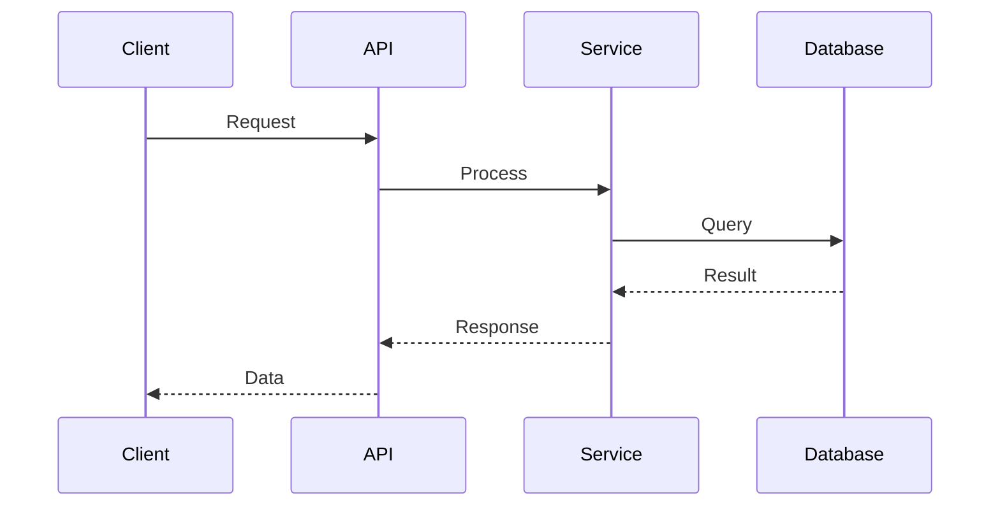

# Contributing Guide

Welcome! This project follows **German precision engineering standards**. Every contribution must meet rigorous quality requirements before it can be merged.

## 🇩🇪 Engineering Philosophy

This project embodies:

- **Root cause fixes** - Never patch symptoms
- **Minimal dependencies** - Each dependency is a liability
- **Long-term thinking** - Code maintainable in 5 years
- **High efficiency** - Every line justified
- **Precision & thoroughness** - 100% test coverage, complete documentation

**Quality is not optional. It is the baseline.**

---

## 📋 Required Verification (Definition of Done)

Every contribution MUST pass ALL these verifications:

### 1. TypeScript Type Checking ✓

```bash
bun run typecheck
```

**Requirements:**

- ✅ Zero TypeScript errors
- ✅ Strict mode enabled
- ✅ No `any` types without justification
- ✅ No `as` casts without justification
- ✅ Effect Language Service diagnostics pass

**Configuration:** `tsconfig.json`

**What it checks:**

- Type correctness
- Effect pipeline errors
- Service requirement validation
- Import/export issues

---

### 2. Code Linting (Oxlint + TSDoc) ✓

```bash
bun run lint
```

**Requirements:**

- ✅ Zero Oxlint errors
- ✅ All warnings addressed
- ✅ TSDoc completeness (all exported functions)
- ✅ Import organization
- ✅ Effect-specific patterns

**TSDoc Standards:**

````typescript
/**
 * Brief description of what the function does and why it exists
 *
 * @param paramName - Description of the parameter
 * @param anotherParam - Description with details
 * @returns Description of what is returned
 * @throws {ErrorType} When this error occurs
 * @example
 * ```ts
 * const result = functionName("input")
 * // result === expected output
 * ```
 */
export function functionName(
  paramName: string,
  anotherParam: number,
): Result {
  // Implementation
}
````

**Required for all exported:**

- Functions
- Classes
- Types (complex ones)
- Constants (non-obvious)

---

### 3. Code Formatting ✓

```bash
bun run format:check  # Check formatting
bun run format        # Auto-fix formatting
```

**Requirements:**

- ✅ Consistent formatting (dprint)
- ✅ No manual formatting needed
- ✅ Automatic via pre-commit hooks

---

### 4. Documentation Quality ✓

```bash
bun run docs:check
```

**Requirements:**

- ✅ TSDoc for all exported functions
- ✅ Feature documentation in `docs/app/[feature-name]/`
- ✅ Mermaid diagrams for architecture
- ✅ Implementation matches documentation

**Documentation Structure:**

```
docs/app/[feature-name]/
├── README.md           # ✅ Required - Overview, purpose, usage
├── architecture.md     # ⚠️  Recommended - Design decisions, trade-offs
├── implementation.md   # ⚠️  Recommended - Technical details, key files
└── diagrams/           # ⚠️  Recommended - Mermaid diagrams
    ├── flow.md        #     Sequence/flow diagrams
    └── structure.md   #     Component/module diagrams
```

**README.md Must Include:**

- Feature overview (what and why)
- Usage examples with code
- Key decisions documented
- Integration points
- Testing notes

**Mermaid Diagram Example:**

````markdown

````

---

### 5. Test Coverage (100%) ✓

```bash
bun run test:coverage        # Run with coverage
bun run test:coverage:ui     # View HTML report
```

**Requirements:**

- ✅ 100% line coverage
- ✅ 100% function coverage
- ✅ 90-100% branch coverage
- ✅ 100% statement coverage
- ✅ All tests passing
- ❌ No skipped tests
- ❌ No commented-out tests

**Test Types:**

- **Unit tests** (`*.test.ts`) - Functions, utilities, services
- **Component tests** (`*.test.tsx`) - React components, hooks
- **Visual tests** (`src/visual/*.test.tsx`) - Visual regression
- **Integration tests** - API endpoints, full flows

**Test Standards:**

```typescript
import { Effect } from "effect"
import { describe, expect, test } from "vitest"

/**
 * Test suite for MyService
 */
describe("MyService", () => {
  /**
   * Tests the happy path
   */
  test("should return expected result on valid input", async () => {
    const result = await Effect.runPromise(
      MyService.doSomething("valid"),
    )

    expect(result).toEqual(expectedValue)
  })

  /**
   * Tests error handling
   */
  test("should throw error on invalid input", async () => {
    await expect(
      Effect.runPromise(MyService.doSomething("invalid")),
    )
      .rejects
      .toThrow("Expected error message")
  })
})
```

**Coverage Report Location:** `coverage/index.html`

---

### 6. Build Success ✓

```bash
bun run build
```

**Requirements:**

- ✅ Production build succeeds
- ✅ No build errors
- ✅ Bundle size within limits
- ✅ All assets generated

---

### 7. Performance (Bundle Size) ✓

```bash
bun run size         # Check bundle size
bun run perf:check   # Build + size check
```

**Requirements:**

- ✅ Bundle size within limits
- ✅ No unexpected size increases
- ✅ Large dependencies justified

---

### 8. Full Validation (All Checks) ✓

```bash
bun run validate
```

**Runs all checks in sequence:**

1. TypeScript type checking
2. Oxlint + TSDoc linting
3. Code formatting check
4. Documentation quality
5. Test coverage (100%)
6. Production build
7. Bundle size check

**This is your definition of done.** If `validate` fails, your work is not complete.

---

## 🔄 Git Workflow (Mandatory)

### Always Use Git Worktrees

**NEVER work directly on master.** Use worktrees for ALL development:

```bash
# 1. Create worktree for your feature
git worktree add .worktrees/feature-name -b feature/feature-name
cd .worktrees/feature-name

# 2. Implement changes, commit frequently
git commit -m "feat: add initial feature structure"
git commit -m "feat: implement core functionality"
git commit -m "test: add comprehensive tests"
git commit -m "docs: document feature in docs/app/"

# 3. Push and create PR
git push -u origin feature/feature-name
gh pr create --title "Add feature-name" --body "..."

# 4. After PR merged, cleanup
cd ../..
git worktree remove .worktrees/feature-name
git branch -d feature/feature-name
```

**Branch Naming:**

- `feature/` - New features
- `fix/` - Bug fixes
- `refactor/` - Code refactoring
- `docs/` - Documentation updates

### Step-wise Commits

**Commit frequently** after each logical unit of work:

✅ **Good commit flow:**

```bash
git commit -m "feat: add User schema with validation"
git commit -m "feat: implement JWT token generation"
git commit -m "test: add user authentication tests"
git commit -m "docs: document auth flow in docs/app/user-auth/"
```

❌ **Bad commit flow:**

```bash
git commit -m "feat: add complete user authentication system"
# One giant commit with everything
```

**Each commit should:**

- Have a clear, single purpose
- Pass all verification checks
- Follow conventional commits format
- Tell a story when reviewed

**Conventional Commits:**

- `feat:` - New feature
- `fix:` - Bug fix
- `docs:` - Documentation only
- `test:` - Tests only
- `refactor:` - Code refactoring
- `perf:` - Performance improvement
- `chore:` - Build/tooling changes

---

## 🚀 Pull Request Process

### 1. Before Creating PR

**Checklist:**

- [ ] Created git worktree for feature
- [ ] Read relevant documentation in `docs/`
- [ ] Implemented with German precision
- [ ] Added comprehensive tests (100% coverage)
- [ ] Added TSDoc to all functions
- [ ] Created feature documentation
- [ ] Added Mermaid diagrams
- [ ] Simplicity assessment completed (time/randomness/policy boundaries explicit)
- [ ] Step-wise commits with clear messages
- [ ] `bun run validate` passes ✓

### 2. PR Template

```markdown
## Summary

Brief overview of what and why

## Changes

- List of key changes
- Reference file paths (src/lib/auth.ts:45)
- Explain design decisions

## Testing

- How it was tested
- Coverage achieved (100%)
- Edge cases covered

## Simplicity Assessment

- What responsibilities were separated?
- Where are time and randomness now introduced?
- Which boundaries became more replaceable or testable?
- What coupling was removed or intentionally preserved?

## Documentation

- Link to docs/app/[feature]/
- Mermaid diagrams added
- TSDoc complete

## Checklist

- [ ] All tests pass
- [ ] 100% coverage achieved
- [ ] Documentation complete
- [ ] Simplicity assessment included
- [ ] `bun run validate` passes
- [ ] Step-wise commits
```

### 3. PR Requirements

**Must pass:**

- ✅ All CI checks (GitHub Actions)
- ✅ Code review approved
- ✅ No merge conflicts
- ✅ Documentation reviewed
- ✅ Tests reviewed

**Merge Strategy:**

- Use **merge commits** (not squash, not rebase)
- Preserve step-wise commit history
- Commits tell implementation story

---

## 🔍 CI/CD Pipeline

### GitHub Actions Jobs

All PRs run these checks:

**Job 1: Type Check** (10 min timeout)

- TypeScript compilation
- Effect Language Service diagnostics
- Zero errors required

**Job 2: Lint** (10 min timeout)

- Oxlint validation
- TSDoc completeness
- Code formatting check

**Job 3: Documentation Quality** (5 min timeout)

- docs/app/ structure verification
- Mermaid diagram checks
- Documentation completeness

**Job 4: Build** (15 min timeout)

- Production build
- Bundle size check
- Asset generation

**Job 5: Unit Tests** (10 min timeout)

- Run all unit tests
- Fast feedback

**Job 6: Component Tests** (20 min timeout)

- Multi-browser testing (Chromium, Firefox, WebKit)
- Visual regression tests
- Component tests

**All jobs must pass** before merge is allowed.

---

## 📊 Local Development Workflow

### Quick Reference

```bash
# Start development server
bun run dev

# Run checks individually
bun run typecheck          # Type checking
bun run lint               # Linting + TSDoc
bun run lint:fix           # Auto-fix linting
bun run format             # Format code
bun run format:check       # Check formatting
bun run docs:check         # Documentation quality
bun run test               # Run all tests
bun run test:coverage      # Tests with coverage
bun run test:coverage:ui   # View coverage report
bun run build              # Production build
bun run size               # Check bundle size

# Full validation (recommended before commit)
bun run validate           # ALL checks
```

### Recommended Development Flow

```bash
# 1. Create worktree
git worktree add .worktrees/feature-auth -b feature/auth
cd .worktrees/feature-auth

# 2. Implement feature (TDD approach)
# Write test → Implement → Verify → Commit
bun run test:watch        # Watch mode for TDD

# 3. Check frequently during development
bun run typecheck         # Quick type check
bun run test:coverage     # Verify coverage

# 4. Before committing
bun run validate          # Full validation

# 5. Commit (pre-commit hooks run automatically)
git commit -m "feat: add user authentication"

# 6. Push and create PR
git push -u origin feature/auth
gh pr create
```

---

## 🚫 Common Mistakes (Avoid These)

### ❌ Anti-Patterns

1. **Working directly on master**
   - Always use worktrees
   - Keep master clean and deployable

2. **One giant commit**
   - Commit frequently after logical units
   - Step-wise commits for reviewability

3. **Skipping verification**
   - "It compiles so it's fine" ← Wrong
   - Run `bun run validate` before pushing

4. **Missing documentation**
   - "Code is self-documenting" ← Wrong
   - Add TSDoc + feature docs

5. **Incomplete tests**
   - "I'll add tests later" ← Wrong
   - Write tests alongside code

6. **Ignoring linting errors**
   - "I'll fix it later" ← Wrong
   - Oxlint errors block CI

7. **Patching symptoms**
   - "This fixes my immediate problem" ← Wrong
   - Find and fix root cause

8. **Adding unnecessary dependencies**
   - "This library is cool" ← Wrong
   - Justify every dependency

9. **Using any/as without justification**
   - "TypeScript is too hard" ← Wrong
   - Type everything properly

10. **Squashing commits in PRs**
    - "Clean history looks better" ← Wrong
    - Preserve step-wise history

---

## 📚 Additional Resources

### Project Documentation

- 📚 [Getting Started Guide](./docs/guides/getting-started.md)
- 🏗️ [Architecture Overview](./docs/architecture/overview.md)
- 🧪 [Testing Guide](./docs/guides/testing.md)
- 📊 [Telemetry Guide](./docs/guides/telemetry.md)
- 📈 [PostHog Guide](./docs/guides/posthog.md)
- 🐳 [Docker Guide](./docs/guides/docker.md)
- ✨ [Code Quality Guide](./docs/guides/code-quality.md)
- ⚡ [Performance Monitoring](./docs/guides/performance-monitoring.md)
- 📖 [Feature Documentation Standards](./docs/app/README.md)

### Effect-TS Resources

```bash
effect-solutions list                    # See all topics
effect-solutions show services-and-layers
effect-solutions show data-modeling
effect-solutions show error-handling
effect-solutions show testing
```

### Local Effect Source

```
~/.local/share/effect-solutions/effect
```

Grep for real implementation examples:

```bash
cd ~/.local/share/effect-solutions/effect
grep -r "Context.Tag" packages/
```

### External Resources

- [Effect Documentation](https://effect.website)
- [TanStack Router](https://tanstack.com/router/latest)
- [Vitest](https://vitest.dev)
- [Bun](https://bun.sh)

---

## 🆘 Getting Help

### Before Asking

1. Check existing documentation (`docs/`)
2. Search issues on GitHub
3. Run `effect-solutions show [topic]`
4. Review similar code in the codebase

### When Asking

Provide:

- What you're trying to accomplish
- What you've tried
- Error messages (full output)
- Relevant code (minimal reproduction)
- Environment (OS, Bun version, etc.)

---

## 📖 Philosophy Reminder

**You are not just writing code. You are maintaining a system.**

Every change you make will be read, debugged, and modified by future maintainers (including future you). Write code and documentation with the precision and thoroughness of a German technical manual.

- **Fix root causes**, not symptoms
- **Use minimal dependencies** - each one is a liability
- **Think long-term** - maintainable for 5 years
- **Be efficient** - every line justified
- **Be precise** - 100% coverage, complete docs

**Quality is not optional. It is the baseline.**

---

_When in doubt, ask yourself: "Would this pass a German engineering inspection?" If no, keep working._

🇩🇪 **Präzision. Gründlichkeit. Qualität.**
