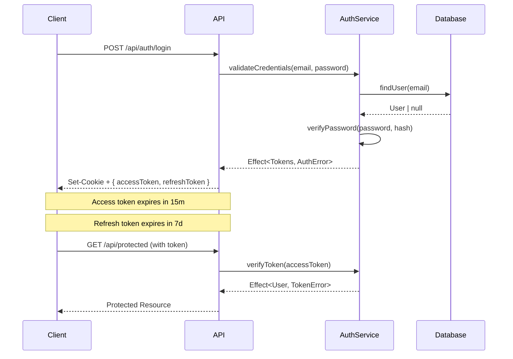

# Application Documentation

This directory contains **detailed documentation for all features and significant changes** made to the application.

## Purpose & Structure

When AI agents or developers implement features, fix bugs, or make significant changes to the system, they **must document their work here** with the precision and thoroughness of a German technical manual. For Bugs that means writing a clear commit description that includes the big and reasoning using conventional commits and the reasoning for the fix/change. We can therefore save on documentation scope because version control extends it with the details of why something changed. Documentation therefore does not need to document every single small thing. It needs to be available to serve as reference, guide and overarching map to the system.

Each feature, bug fix, or significant change only gets its own file if it is not better suited in a comprehensive document that aligns well.
We want to minimize cognitive overhead and increase density of our documentation. That is most paramount. Striking the balance between just enough so context is explicitly clear and not too much so it's overwhelming. Code for example documents it self with TSDoc and the actual code, so we merely need to document decisions, assumptions and how the code ties together in data flows and on the architectural level.

Preferred compact form:

```text
docs/app/[functional-unit]/README.md
├── # Overview, purpose, usage examples
├── # Design decisions, trade-offs, alternatives considered
├── # Technical details, key files, integration points
└── # Mermaid diagrams for visual clarity when they help
```

Expanded form for larger topics:

```text
docs/app/[functional-unit]/
├── README.md
├── architecture.md
├── implementation.md
└── diagrams/
```

Be aware to not just write what is already in code, if that's the case we can just mention the codefile/function.

## Documentation Standards

### Precision

- Every detail matters - write like a German technical manual
- Be explicit, not implicit - future maintainers don't know your context
- Document the **why**, not just the **what** (code shows what, docs explain why)

### Visual Clarity

- Include Mermaid diagrams when they materially improve understanding
- Prefer one clear diagram over multiple decorative diagrams
- System diagrams for component relationships
- Sequence diagrams for interactions
- Flow charts for decision logic

### Trade-offs

- Document **alternatives considered** and why they were rejected
- Explain **design decisions** and their implications
- Note **limitations** and potential future improvements

### Maintainability

- Write for someone who knows nothing about your change
- Link to related documentation in `docs/guides/` and `docs/architecture/`
- Reference specific file paths and line numbers where relevant

## Examples

### Good Feature Documentation

Compact form:

```text
docs/app/user-authentication/README.md
├── # What: JWT-based auth with refresh tokens
├── # Why: Stateless, scalable, works with SSR
├── # Trade-off: JWT over sessions
├── # Files: src/lib/auth.ts, src/routes/api/auth/
└── # Mermaid diagrams when they clarify the design
```

Expanded form for larger topics:

```text
docs/app/user-authentication/
├── README.md
├── architecture.md
├── implementation.md
└── diagrams/
```

### Mermaid Diagram Example

````markdown
# Authentication Flow


````

## When to Document

### Always Document

- ✅ New features (authentication, payments, API integrations)
- ✅ Significant refactors (state management changes, architecture shifts)
- ✅ Complex bug fixes (root cause analysis, solution explanation) -> if not well suited in docs then append to general LEARNINGS.md
- ✅ Performance optimizations (before/after, trade-offs) -> if not well suited in docs then append to general LEARNINGS.md
- ✅ Integration with external services (APIs, databases, analytics)

### Optional (but encouraged)

- Minor bug fixes with interesting root causes
- Utility functions with non-obvious behavior
- Configuration changes with important implications

### Skip

- Trivial changes (typos, formatting)
- Self-explanatory code additions
- Changes already covered in existing docs

## Current Feature Documents

- `docs/app/todo-dashboard.md` — richer todo sample, snapshot data flow, and dashboard invariants
- `docs/app/todo-dashboard-data-flow.md` — Solid migration boundaries and canonical snapshot mutation strategy

## Related Documentation

- **System Architecture**: `docs/architecture/overview.md`
- **Code Quality Standards**: `docs/guides/code-quality.md`
- **Testing Patterns**: `docs/guides/testing.md`
- **Performance Guidelines**: `docs/guides/performance-monitoring.md`

---

**Remember**: You are not just writing code. You are maintaining a system. Document with the precision of a German engineering manual.
Default to the smallest documentation shape that explains the change well. One dense README.md per functional unit is preferred unless the topic is large enough to justify splitting into architecture.md, implementation.md, or diagrams/.
For simple learnings we have LEARNINGS.md
