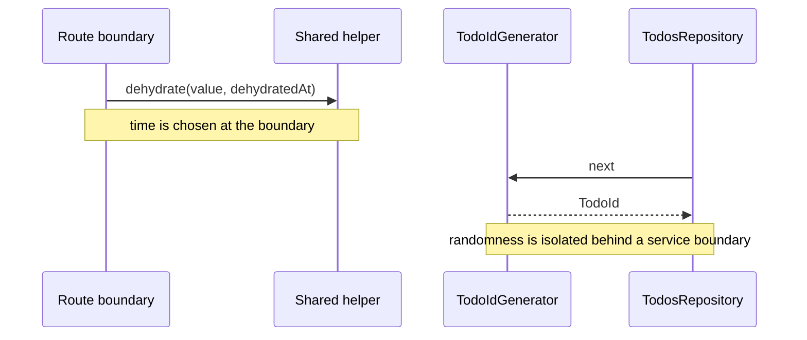

# Flow

```mermaid
sequenceDiagram
    participant Route as Route boundary
    participant Helper as Shared helper
    participant Service as TodoIdGenerator
    participant Repo as TodosRepository

    Route->>Helper: dehydrate(value, dehydratedAt)
    Note over Route,Helper: time is chosen at the boundary

    Repo->>Service: next
    Service-->>Repo: TodoId
    Note over Service,Repo: randomness is isolated behind a service boundary
```
