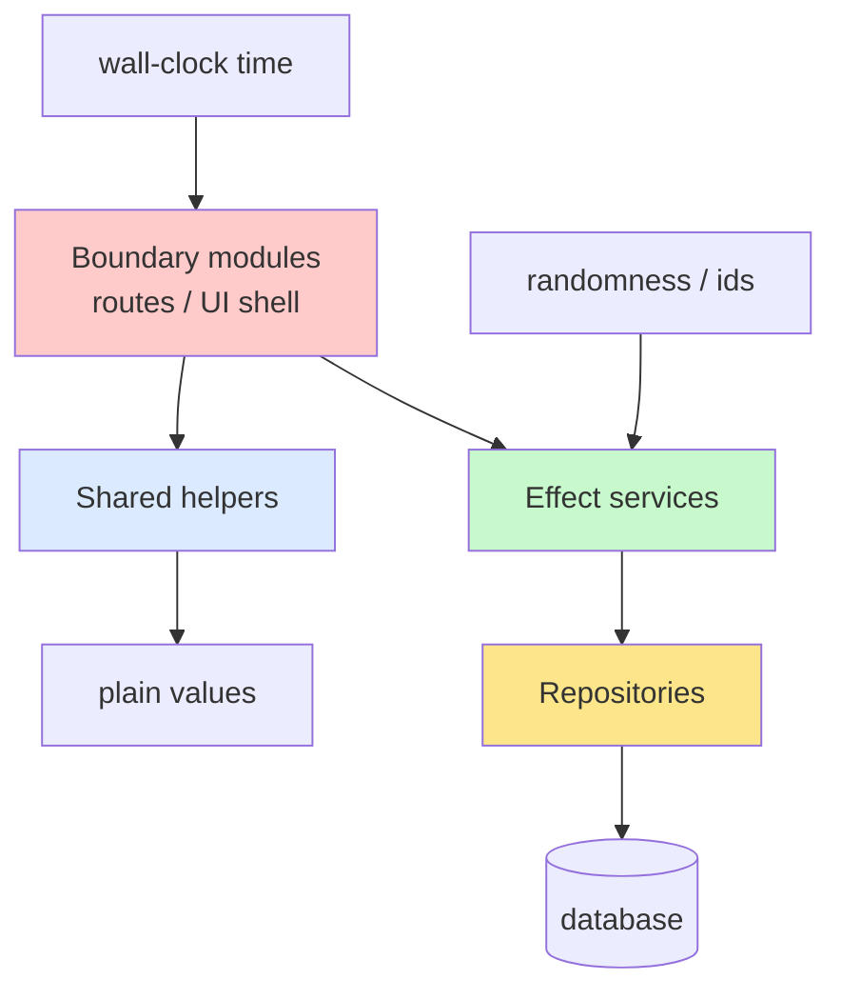

# Structure

```mermaid
graph TB
    Boundary[Boundary modules\n routes / UI shell] --> Shared[Shared helpers]
    Boundary --> Services[Effect services]
    Services --> Repo[Repositories]

    Time[wall-clock time] --> Boundary
    Randomness[randomness / ids] --> Services

    Shared --> Data[plain values]
    Repo --> Persistence[(database)]

    style Boundary fill:#fecaca
    style Shared fill:#dbeafe
    style Services fill:#c7f9cc
    style Repo fill:#fde68a
```
