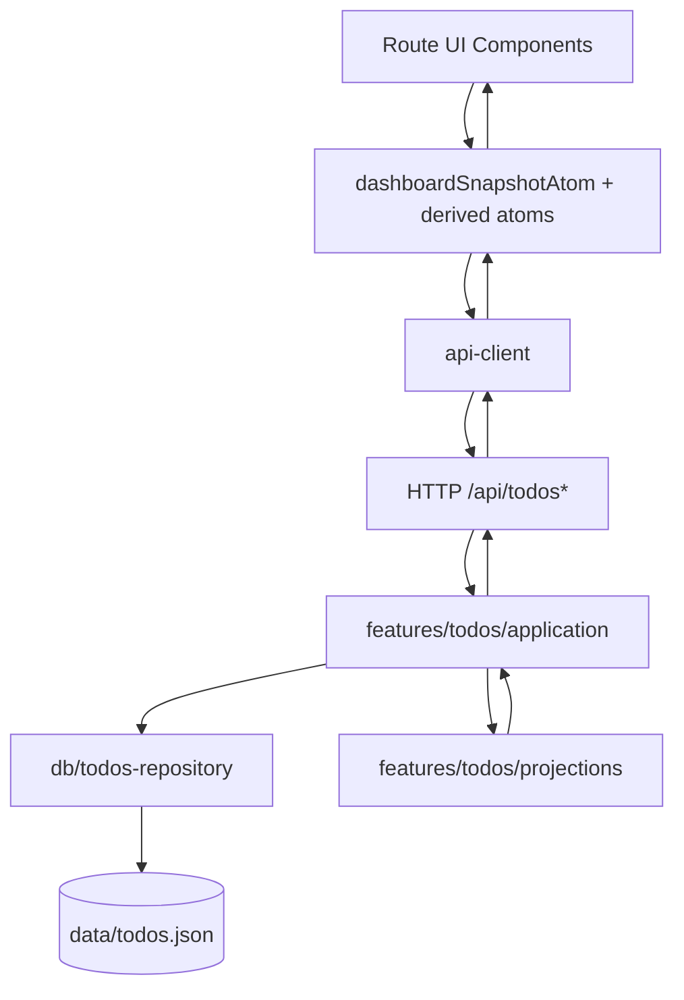

# Todo Dashboard Data Flow (Solid)

## Why this note exists

This document captures the migrated architecture and the canonical snapshot strategy so maintainers can reason about persistence, async state, and UI synchronization without reverse-engineering route internals.

## Boundaries

- **API boundary** (`src/routes/api/$.ts`)
  - Receives HTTP requests for snapshot + CRUD.
  - Delegates to feature application use-cases.
- **Application boundary** (`src/features/todos/application.ts`)
  - Owns use-case orchestration.
  - Returns canonical `TodoDashboardSnapshot` after each mutation.
- **Persistence boundary** (`src/db/todos-repository.ts`)
  - Owns durable storage operations (`list/create/update/remove`).
  - Uses embedded PostgreSQL via PGlite (`data/pglite`).
- **Projection boundary** (`src/features/todos/projections.ts`)
  - Derives ordered list, stats, and groups from canonical todo records.
- **Client atom boundary** (`src/atoms.ts`)
  - Maintains async canonical snapshot atom and derived read-model atoms.
  - Mutation atoms replace local snapshot from server response.
- **UI boundary** (`src/routes/-index/*`)
  - Composes read models via atoms and design-system components.

## Canonical snapshot strategy

The source of truth is the server-produced `TodoDashboardSnapshot`.

- Initial load fetches snapshot via `dashboardSnapshotRemoteAtom`.
- `todosAtom`, `statsAtom`, and `todoGroupsAtom` are projections over snapshot state.
- Successful mutations return updated snapshot and replace local canonical value.
- Explicit refresh re-fetches remote snapshot.

This avoids divergence between independently maintained client read models.

## Data flow

## Mutation update strategy

1. User action triggers `createTodoAtom` / `updateTodoAtom` / `deleteTodoAtom`.
2. Client sends request to API.
3. Application executes persistence operation.
4. Application returns fresh canonical snapshot.
5. Atom writes `AsyncResult.success(snapshot)` into `dashboardSnapshotAtom`.
6. All projections update from same canonical value.

## Known differences vs baseline

- Persistence uses local embedded PostgreSQL (PGlite) in this project.
- The design-system implementation is lightweight/local, but it enforces the same composition principle (UI composes DS primitives/components rather than route-local ad-hoc styling).
