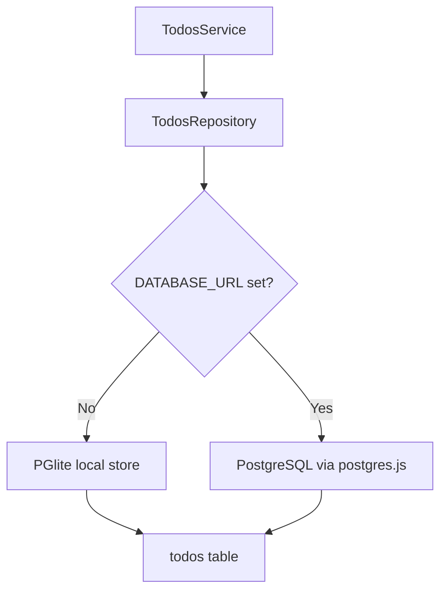
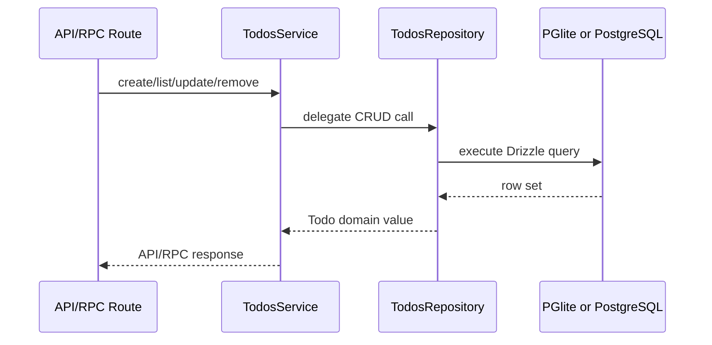

# Todo Persistence

The todo API now uses one PostgreSQL-shaped persistence model across local and
remote environments.

## Why

The previous implementation stored todos in an in-memory `Ref`, which reset on
every server restart and diverged from the PostgreSQL path described in the
project guides. That made local behavior unrealistic and forced future database
work to bridge from an ad hoc in-memory service rather than from the actual
schema.

This change removes that split:

- local development without `DATABASE_URL` uses PGlite
- shared and deployed environments with `DATABASE_URL` use PostgreSQL
- both paths use the same Drizzle `pg-core` schema and CRUD repository

## Design



## Trade-offs

- We create the `todos` table on startup instead of introducing migration
  tooling immediately.
- This keeps the baseline small, but it is intentionally a transitional step.
  If the schema grows, the next step should be explicit Drizzle migrations.
- The repository remains server-oriented. The current Vitest browser matrix does
  not model this cleanly, so server-side repository tests are verified in node
  mode.

## Seeded Verification

The node-mode todo tests now use seeded in-memory PGlite layers instead of
building their starting state through repeated setup calls. This keeps
verification on the real Drizzle repository path while making invariants
explicit:

- `empty` proves zero-state behavior
- `singleCompleted` proves completed-state round-tripping
- `mixedState` proves deterministic list order and single-row deletion

The seed wiring lives in `src/db/todos-test-support.ts` and composes through
`TodosService.layerFromSeed(...)`, so service, HTTP handler, and RPC tests all
exercise the same persistence behavior.

## Key Files

- `src/db/schema.ts`
- `src/db/todos-repository.ts`
- `src/routes/api/-lib/todos-service.ts`
- `docs/guides/database-pglite.md`

## Runtime Flow

```ts
// Local development: omit DATABASE_URL and PGlite is used automatically
PGLITE_DATA_DIR = "./data/pglite"
```


