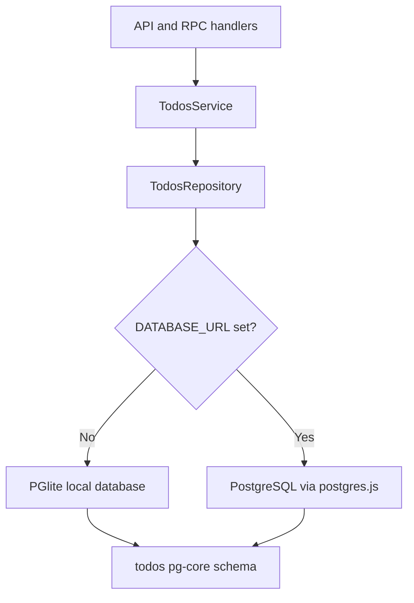

# Todo Persistence Architecture

The todo stack now uses one PostgreSQL-shaped persistence boundary across local
and remote environments. The architectural goal is to remove the split between
an in-memory development path and a PostgreSQL production path.

## Decision

- Use one Drizzle `pg-core` schema for all todo persistence
- Use PGlite as the local embedded Postgres runtime
- Use PostgreSQL via `postgres.js` when `DATABASE_URL` is configured
- Keep the service boundary stable so API and RPC layers do not know which
  database adapter is active

## Why This Shape

The previous `Ref`-backed implementation was easy to start with, but it broke
the core invariant that local behavior should match the production persistence
model closely enough to trust integration tests and operational debugging.

Using PGlite locally fixes the root cause:

- local and remote both speak the Postgres dialect
- one schema defines table shape, ordering, and query semantics
- tests can prove invariants against persisted state instead of mocked state

## Architecture Diagram

## Current Limits

- Table creation still happens at startup rather than through formal migrations
- Browser-mode Vitest should not import the server-side PGlite repository path
- PGlite seed helpers are intended for node-mode invariant tests, not browser
  component tests
