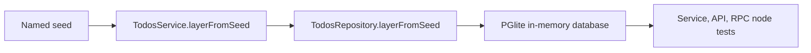

# Seeded Test Flow

```mermaid
flowchart LR
    Seed[Named seed] --> Layer[TodosService.layerFromSeed]
    Layer --> Repo[TodosRepository.layerFromSeed]
    Repo --> DB[PGlite in-memory database]
    DB --> Tests[Service, API, RPC node tests]
```
