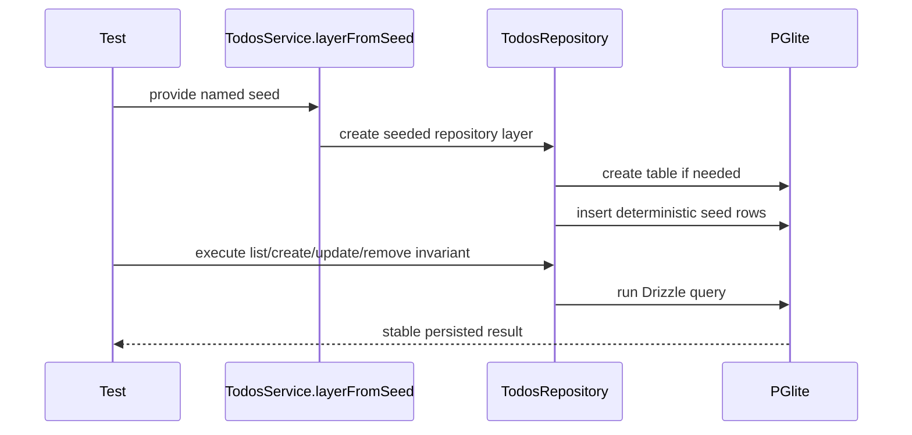

# Todo Persistence Implementation

## Key Modules

- `src/db/schema.ts`
  Defines the shared Drizzle Postgres schema for todos.
- `src/db/todos-repository.ts`
  Selects PGlite or PostgreSQL, creates the table if needed, and implements
  CRUD operations with identical result mapping.
- `src/db/todos-test-support.ts`
  Defines named seeded states for invariant-style tests.
- `src/routes/api/-lib/todos-service.ts`
  Exposes the repository through the Effect service boundary and adds
  `layerFromSeed(...)` for node-mode tests.

## Seeded Test Flow

The seeded test helper does not construct state by issuing application-level
setup calls inside each test. Instead, it preloads deterministic rows directly
into the in-memory PGlite database before the service layer is provided.

That implementation choice matters because it guarantees:

- deterministic ids for seeded rows
- deterministic `created_at` ordering
- one reusable seeded state shared across service, HTTP handler, and RPC tests

## Sequence

## Verification

The seeded invariant path is currently verified with:

- `bun run typecheck`
- `bun run lint`
- `bun run docs:check`
- `bunx vitest run --browser.enabled=false src/routes/api/-lib/todos-service.test.ts src/routes/api/-lib/todos-api-live.test.ts src/routes/api/-lib/todos-rpc-live.test.ts`
