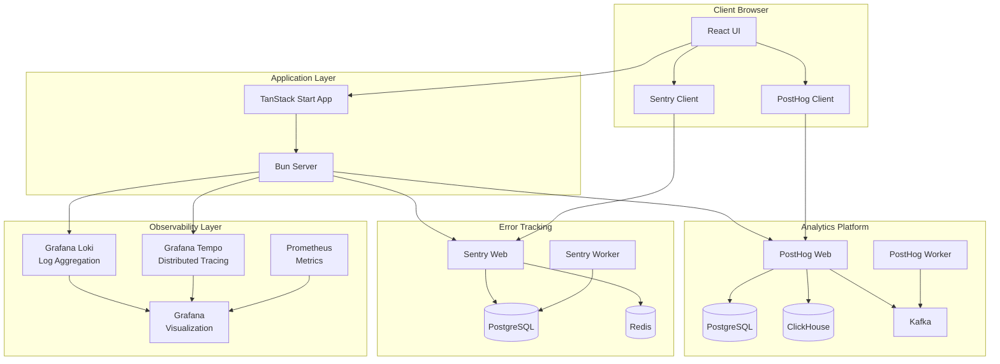
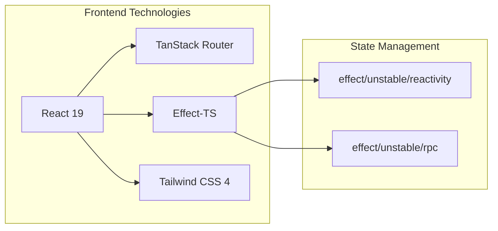
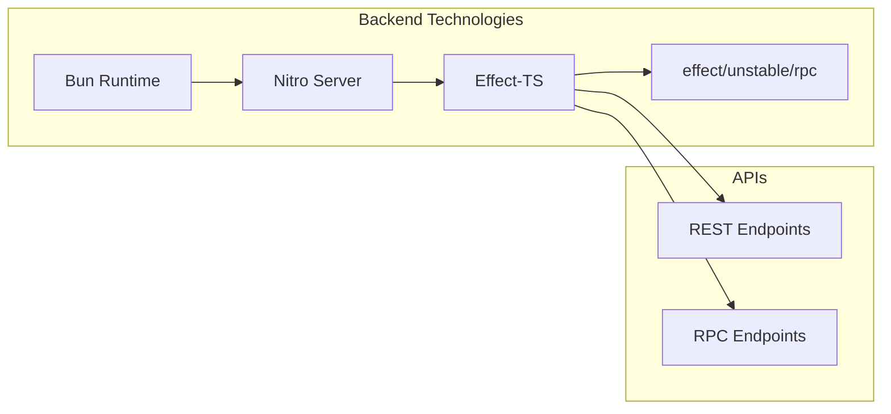
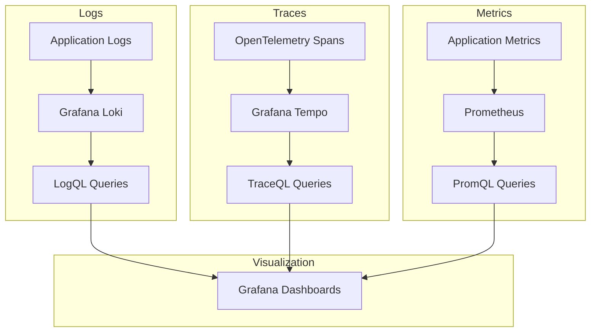
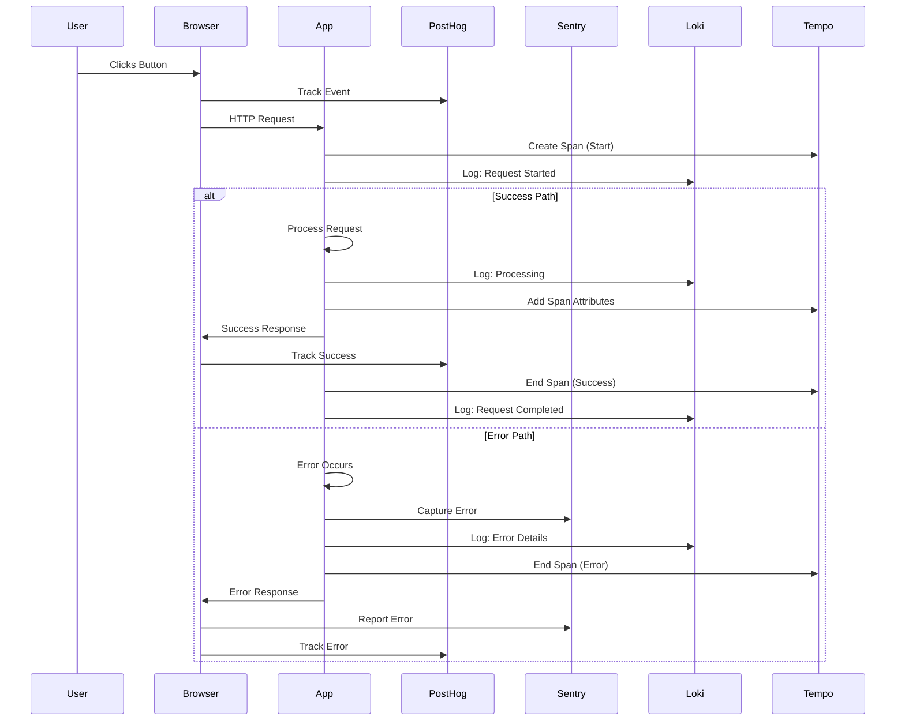
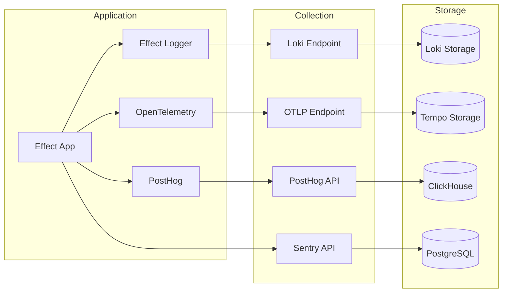
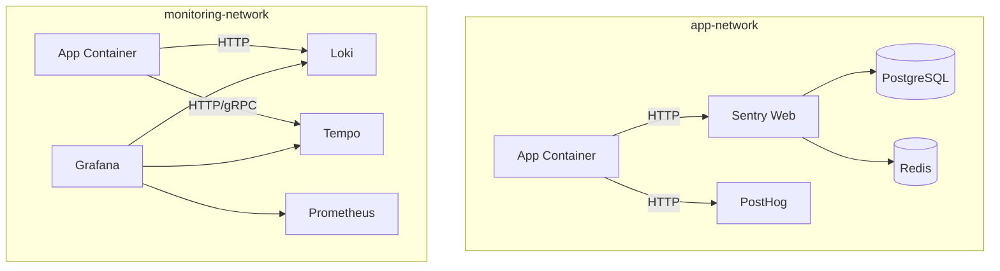
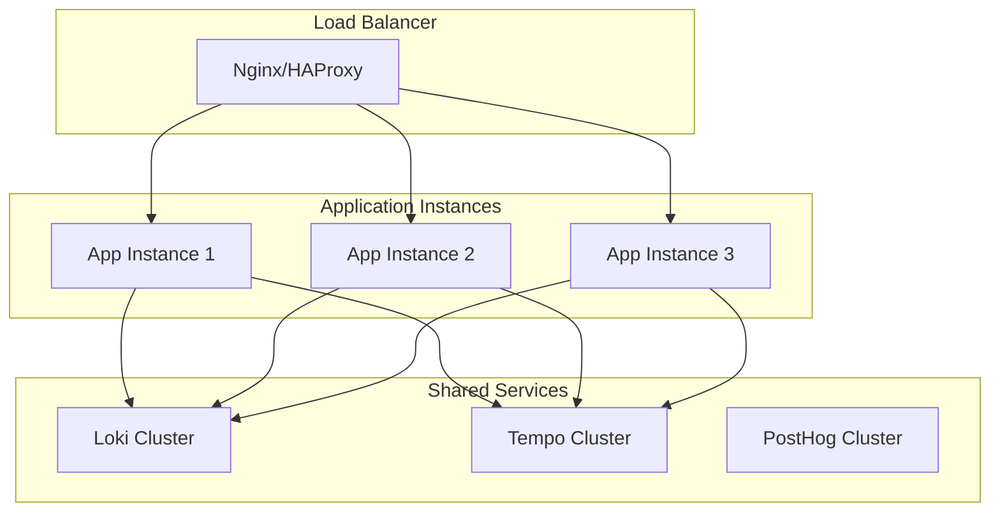
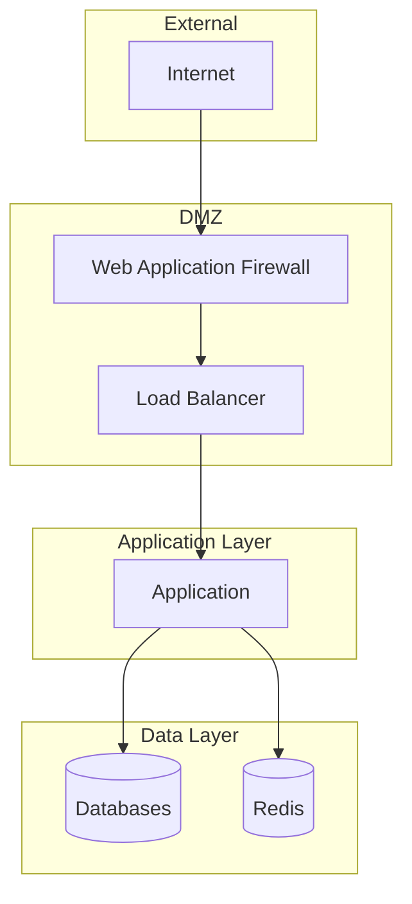

# Architecture Overview

This document provides a high-level overview of the Effect TanStack Start application architecture, including all monitoring, observability, and analytics components.

## Table of Contents

- [System Architecture](#system-architecture)
- [Template Feature Shape](#template-feature-shape)
- [Application Stack](#application-stack)
- [Observability Stack](#observability-stack)
- [Data Flow](#data-flow)
- [Technology Choices](#technology-choices)

---

## System Architecture



---

## Template Feature Shape

The template now biases feature code toward a small set of explicit roles:

```text
src/features/[feature]/
├── application.ts
├── projections.ts
├── events.ts
└── adapters/
```

This keeps larger CRUD systems from folding route logic, persistence policy,
read-model derivation, and replication concerns into one module family.

See:

- `docs/architecture/template-simple-crud.md`
- `docs/architecture/effect-simple-made-easy-mapping.md`
- `docs/architecture/simple-made-easy.md`

---

## Application Stack

### Frontend Stack



**Key Technologies:**

- **React 19** - UI framework with server components
- **TanStack Router** - Type-safe routing with SSR
- **Effect-TS** - Functional effect system for business logic
- **effect/unstable/reactivity + @effect/atom-react** - Atomic state management
- **effect/unstable/rpc** - Type-safe RPC between client and server
- **Tailwind CSS 4** - Utility-first CSS framework

### Backend Stack



**Key Technologies:**

- **Bun** - Fast JavaScript runtime
- **Nitro** - Universal server framework
- **Effect-TS** - Functional effect system
- **effect/unstable/rpc** - Type-safe client-server communication

---

## Observability Stack

### The Three Pillars



### Component Responsibilities

| Component         | Purpose                   | Port             | Data Format       |
| ----------------- | ------------------------- | ---------------- | ----------------- |
| **Grafana Loki**  | Log aggregation & storage | 3100             | JSON, logfmt      |
| **Grafana Tempo** | Distributed tracing       | 3200, 4317, 4318 | OTLP, Jaeger      |
| **Prometheus**    | Metrics collection        | 9090             | Prometheus format |
| **Grafana**       | Unified visualization     | 3001             | -                 |

---

## Data Flow

### Request Lifecycle



### Observability Data Flow



---

## Technology Choices

### Why Effect-TS?

**Benefits:**

1. **Type Safety** - Compile-time guarantees for error handling
2. **Composability** - Build complex workflows from simple effects
3. **Testability** - Easy to test with dependency injection
4. **Observability** - Built-in support for tracing and logging
5. **Resource Management** - Automatic cleanup with scopes

**Example:**

```typescript
const program = Effect.gen(function*() {
  // Automatic tracing
  const user = yield* fetchUser(userId).pipe(
    Effect.withSpan("fetchUser"),
  )

  // Automatic logging
  yield* Effect.log("User fetched", { userId: user.id })

  // Automatic resource cleanup
  const db = yield* Database
  yield* db.query("...")
})
```

### Why Bun?

**Benefits:**

1. **Performance** - 3x faster than Node.js
2. **Native TypeScript** - No transpilation needed
3. **Built-in Tools** - Package manager, bundler, test runner
4. **Modern APIs** - Web standards compliance
5. **Development Speed** - Fast installation and hot reload

### Why TanStack Start?

**Benefits:**

1. **Type Safety** - End-to-end type safety
2. **SSR/SSG** - Server-side rendering and static generation
3. **File-based Routing** - Intuitive route organization
4. **Data Loading** - Optimized data fetching
5. **Modern DX** - Great developer experience

### Why Grafana Stack?

**Benefits:**

1. **Unified Platform** - Single pane of glass for observability
2. **Open Source** - No vendor lock-in
3. **Correlation** - Link logs, traces, and metrics
4. **Flexibility** - Extensible with plugins
5. **Cost Effective** - Self-hosted option available

### Why PostHog?

**Benefits:**

1. **All-in-One** - Analytics, feature flags, session replay
2. **Privacy First** - Self-hosted option, GDPR compliant
3. **Developer Friendly** - API-first design
4. **Real-time** - Instant insights
5. **Open Source** - Transparent and extensible

### Why Sentry?

**Benefits:**

1. **Error Tracking** - Comprehensive error monitoring
2. **Performance** - Transaction tracing
3. **Release Tracking** - Deploy monitoring
4. **Integrations** - Works with everything
5. **Self-hosted** - Full control over data

---

## Service Communication

### Internal Network Communication



**Networks:**

- **app-network** - Application and databases
- **monitoring-network** - Observability stack

**Why Two Networks?**

1. **Security** - Isolate monitoring from application
2. **Performance** - Separate traffic
3. **Scalability** - Independent scaling
4. **Organization** - Clear separation of concerns

---

## Scalability Considerations

### Horizontal Scaling



**Scaling Strategy:**

1. **Application** - Scale horizontally with multiple instances
2. **Databases** - Use managed services or replicas
3. **Observability** - Use clustered deployments
4. **Analytics** - PostHog handles high throughput

---

## Security Architecture



**Security Measures:**

1. **Network Isolation** - Separate networks for different concerns
2. **Secret Management** - Environment variables, never in code
3. **Authentication** - Built-in to all monitoring tools
4. **HTTPS/TLS** - Encrypted communication (production)
5. **Regular Updates** - Keep dependencies current

---

## Next Steps

- [Getting Started Guide](../guides/getting-started.md)
- [Simple Made Easy](./simple-made-easy.md)
- [Testing Guide](../guides/testing.md)
- [Telemetry Guide](../guides/telemetry.md)
- [Observability Setup](../guides/observability-setup.md)
