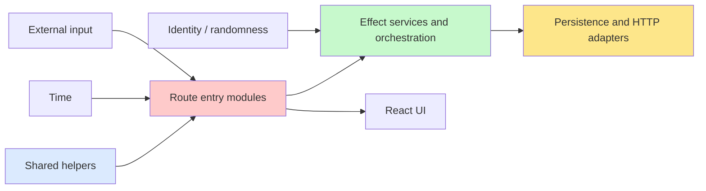

# Simple Made Easy

This repository adopts Rich Hickey's distinction from _Simple Made Easy_:

- **simple** means **unentangled**,
- **complex** means **braided together**,
- **easy** means **familiar or nearby**.

The practical consequence for this codebase is that we optimize for
**separation of concerns over short-term familiarity**.

That principle aligns with older software engineering literature as well:

- **Parnas** argued for module boundaries that hide volatile decisions instead
  of organizing code by procedural flow.
- **Brooks** distinguished inherent problem difficulty from accidental
  complexity introduced by the implementation.
- **Hickey** reframed the day-to-day coding version of the same problem as
  avoiding _complecting_ time, state, identity, policy, and execution order.

## Repository interpretation

In this repository, simplicity means:

1. **values over ambient state**,
2. **functions over hidden object state**,
3. **schemas and tagged data over ad hoc wrappers**,
4. **policy separated from transport and persistence**, and
5. **explicit dependencies for time, randomness, and I/O**.

We do not treat these as aesthetic preferences. They are reliability tools.

This document describes the broader architectural interpretation. The lint rules
only codify a narrow subset of that interpretation. They are selected because
those checks have high signal in this repository and can be enforced with low
ambiguity.

## The five design questions

Every new module should answer these questions explicitly:

1. **Who** are the entities or values?
2. **What** operations are supported?
3. **How** is the work implemented behind the boundary?
4. **When / Where** does the work happen, and is timing or location coupled?
5. **Why** do the rules exist, and where is policy encoded?

## Codified repository rules

The repository now enforces a small simplicity baseline in lint and docs.
When this document or its companion feature doc shows a negative snippet, that
snippet should be labelled explicitly as a rejected or historical shape so it
cannot be confused with a recommended reference.

The enforced rules are:

- shared library modules must not read **ambient wall-clock time** directly,
- repository modules must not read **ambient randomness** directly,
- modules must not export **mutable bindings**,
- route entry modules must not own **Effect.gen orchestration**.

These rules are intentionally narrow. They do not attempt to solve all design
quality mechanically. They exist to catch common ways in which otherwise small
modules become entangled.

The route rule is specifically a heuristic. It does not claim that
`Effect.gen(...)` is always wrong. It protects a boundary shape: route entry
files should decode, delegate, and render instead of becoming orchestration
sinks.

The randomness rule also does not claim that randomness must disappear. It
claims that randomness should be sampled at an explicit boundary, such as
`TodoIdGeneratorLive`, rather than deep inside persistence modules.

## Boundary model

### Consequences

- **Routes** decode, delegate, and render.
- **Application modules** orchestrate effects and dependencies.
- **Projections** derive read models from plain data.
- **Adapters** translate to databases and external APIs.
- **Shared utilities** should accept time and identity as arguments instead of
  sampling them implicitly.

The todo feature now models this explicitly through:

- `src/features/todos/application.ts`
- `src/features/todos/projections.ts`
- `src/features/todos/events.ts`

## Review checklist

When reviewing a change, ask:

- Did we reduce or increase coupling?
- Is time passed in or sampled implicitly?
- Is randomness injected or read ambiently?
- Does the route file delegate, or did it become a hidden service layer?
- Would a small change in one concern now ripple into unrelated modules?

If the answer suggests a ripple across unrelated concerns, the change likely
increased complexity even if it felt easy to write.

## What this template does not fully codify

The template does not fully encode every recommendation from Hickey's talk.
In particular, it does not try to mechanize all of the following:

- "data as data" as a universal rule across all modules,
- replacing every loop with declarative set operations,
- queue-based decoupling of when/where concerns,
- a global ban on familiar but entangling constructs.

Those remain architectural review concerns rather than lint rules. That is a
conscious trade-off: the template enforces a small baseline and relies on code
review and design docs for the broader philosophy.

## Related repository documents

- `docs/architecture/GUARANTEES.md`
- `docs/guides/code-quality.md`
- `docs/guides/testing.md`
- `docs/app/simple-made-easy/README.md`

🫡🇩🇪 Prussian virtues: keep policy, data, and execution boundaries explicit.
