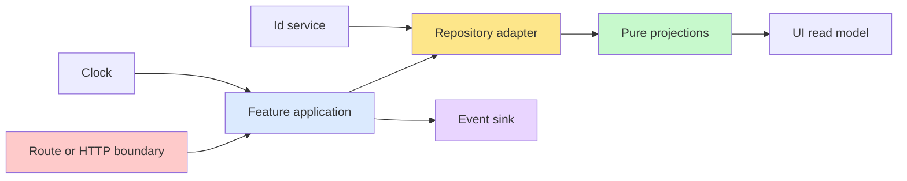

# Template Simple CRUD Architecture

## Intent

This template is meant to scale from a small sample like the todo dashboard to
much larger CRUD applications without forcing every feature into a knot of route
logic, transport handlers, service objects, repository policy, and UI-local
recomputation.

The default feature shape is therefore:

```text
src/features/[feature]/
├── application.ts     # effectful use-cases and orchestration
├── projections.ts     # pure read-model derivation
├── events.ts          # replication / outbox boundary
└── adapters/...       # persistence, http, rpc, jobs, external systems
```

A feature may grow more files, but it should keep those roles distinct.

## Default feature responsibilities

### `application.ts`

Owns use-cases.

Allowed:

- orchestrating ports and dependencies,
- choosing current time through `Clock`,
- publishing domain events,
- combining repository reads with pure projections.

Avoid:

- route-specific request parsing,
- React imports,
- direct transport shapes,
- burying large pure business rules here when they can live in projections or
  domain modules.

### `projections.ts`

Owns pure derivation.

Allowed:

- sorting,
- grouping,
- summary counts,
- read-model shaping,
- pure classification logic over plain data.

Avoid:

- database imports,
- framework imports,
- HTTP/RPC imports,
- React imports,
- ambient time or randomness.

### `events.ts`

Owns the replication boundary.

Allowed:

- event types,
- event sink interfaces,
- no-op and test sinks,
- outbox-compatible contracts.

Avoid:

- transport details,
- persistence decisions unrelated to event publication.

### `adapters/`

Own the "how".

Examples:

- Drizzle repositories,
- HTTP handlers,
- RPC handlers,
- queue workers,
- external API integrations.

Adapters should translate between infrastructure and the feature boundary. They
should not become the home of policy.

## Request / mutation flow



## Larger CRUD systems

For larger applications, this shape generalizes naturally.

### Example domains

- orders
- invoices
- customers
- workflows
- CRM records
- tickets
- notifications

Each feature can keep the same split:

- application orchestrates,
- projections derive read models,
- events support replication and async work,
- adapters translate infrastructure.

### Why this scales

Without this split, larger CRUD systems tend to complect:

- transport and policy,
- persistence and identity generation,
- synchronous mutation flow and async side effects,
- UI-local recomputation and server-derived truth.

That is manageable for one toy route and painful for fifty business workflows.

## Replication growth path

The todo app now includes an explicit event sink boundary even though it still
uses a no-op live implementation by default.

That means larger applications can add:

- outbox persistence,
- async projectors,
- search indexing,
- email or webhook fanout,
- audit streams,
- analytics side effects,

without rewriting the feature boundary itself.

## Rules this architecture expects

- routes decode, delegate, and render,
- repositories persist and translate, not decide policy,
- projections stay pure,
- time, randomness, and replication are explicit,
- lint enforces only the highest-signal boundary rules.

## Related documents

- `docs/architecture/simple-made-easy.md`
- `docs/architecture/effect-simple-made-easy-mapping.md`
- `docs/guides/code-quality.md`
- `docs/app/todo-dashboard.md`
