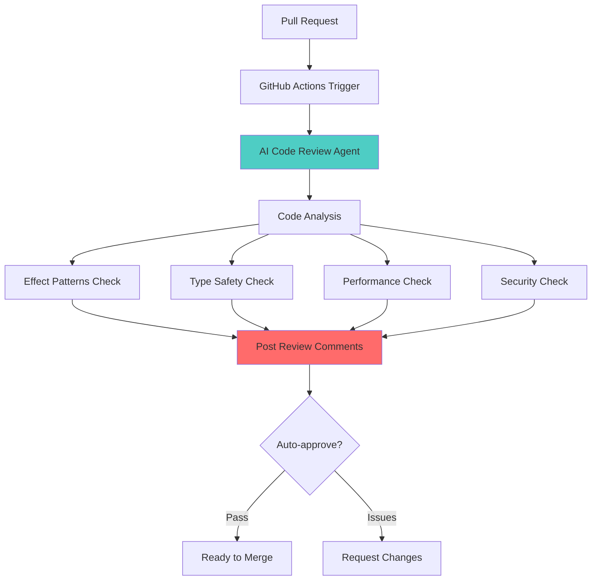
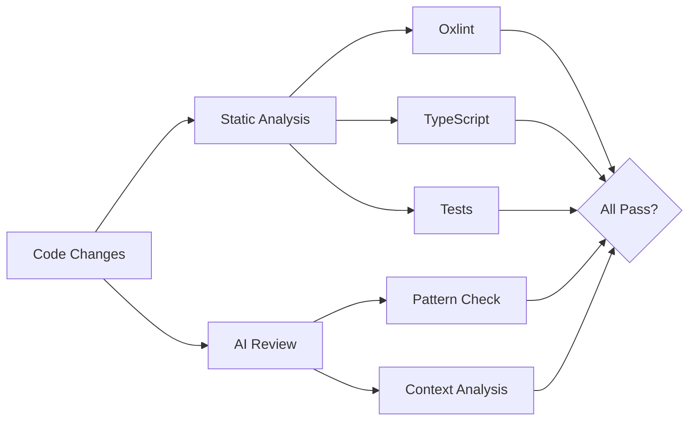

# AI Code Review Integration Guide

Complete guide to integrating AI agents for automated code review in your Effect TanStack Start project.

## Overview



This guide covers:

- AI code review options (GitHub Copilot, Claude, GPT-4, Custom)
- Effect-TS specific review patterns
- GitHub Actions integration
- Custom AI review scripts
- Local AI review tools
- Best practices and limitations

---

## AI Code Review Options

### Option 1: GitHub Copilot (Recommended for GitHub Users)

**Pros:**

- Native GitHub integration
- No API key management
- Free for verified students/educators
- Understands repository context

**Cons:**

- Requires GitHub Copilot subscription
- Limited customization for Effect-TS patterns

**Setup:**

1. Enable GitHub Copilot for your organization
2. Update `.github/workflows/codebase-review.yml`:

```yaml
name: AI Code Review

on:
  pull_request:
    types: [opened, synchronize, reopened]

jobs:
  copilot-review:
    name: GitHub Copilot Code Review
    runs-on: ubuntu-latest
    permissions:
      contents: read
      pull-requests: write

    steps:
      - uses: actions/checkout@v4
        with:
          fetch-depth: 0

      - uses: github/copilot-code-review-action@v1
        with:
          github-token: ${{ secrets.GITHUB_TOKEN }}
```

---

### Option 2: Claude AI (Best for Effect-TS)

**Pros:**

- Excellent at functional programming patterns
- Strong TypeScript understanding
- Can be trained on Effect-TS documentation
- Nuanced code review

**Cons:**

- Requires Anthropic API key
- API costs (but reasonable)

**Setup:**

1. Get an Anthropic API key from https://console.anthropic.com
2. Add as GitHub secret: `ANTHROPIC_API_KEY`
3. Create custom review script:

**File:** `scripts/ai-review.ts`

```typescript
import Anthropic from "@anthropic-ai/sdk"
import { execSync } from "child_process"

const anthropic = new Anthropic({
  apiKey: process.env.ANTHROPIC_API_KEY!,
})

async function reviewCode() {
  // Get diff from PR
  const diff = execSync("git diff origin/main...HEAD").toString()

  const prompt =
    `You are an expert code reviewer specializing in Effect-TS and TypeScript.

Review this code diff and provide feedback on:

1. **Effect-TS Best Practices:**
   - Proper use of Effect.gen patterns
   - Error handling with Effect.fail/Effect.try
   - Avoiding try-catch in Effect.gen
   - Use of yield* vs Effect.runSync
   - Layer composition and dependency injection

2. **Type Safety:**
   - Avoiding 'any' type assertions
   - Proper type inference
   - Type-safe error handling

3. **Performance:**
   - Unnecessary computations
   - Memory leaks
   - Effect pipeline optimization

4. **Code Quality:**
   - Function complexity
   - Code duplication
   - Naming conventions

Code diff:
\`\`\`diff
${diff}
\`\`\`

Provide specific, actionable feedback with line numbers where applicable.
Format your response as markdown with clear sections.`

  const message = await anthropic.messages.create({
    model: "claude-sonnet-4-20250514",
    max_tokens: 4096,
    messages: [{ role: "user", content: prompt }],
  })

  const review = message.content[0].type === "text"
    ? message.content[0].text
    : ""

  console.log("## AI Code Review\n")
  console.log(review)

  // Post as PR comment (requires GitHub API integration)
  return review
}

reviewCode().catch(console.error)
```

**Install dependencies:**

```bash
bun add -d @anthropic-ai/sdk
```

**Update workflow:**

```yaml
- name: Setup Bun
  uses: oven-sh/setup-bun@v2

- name: Install dependencies
  run: bun install --frozen-lockfile

- name: Run Claude AI review
  env:
    ANTHROPIC_API_KEY: ${{ secrets.ANTHROPIC_API_KEY }}
  run: bun run scripts/ai-review.ts
```

---

### Option 3: OpenAI GPT-4 (Alternative)

**Pros:**

- Well-established API
- Good general code understanding
- Many integration options

**Cons:**

- Less specialized in Effect-TS
- Higher API costs
- May need more prompt engineering

**Setup:**

Create `scripts/ai-review-gpt.ts`:

```typescript
import { execSync } from "child_process"
import OpenAI from "openai"

const openai = new OpenAI({
  apiKey: process.env.OPENAI_API_KEY!,
})

async function reviewCode() {
  const diff = execSync("git diff origin/main...HEAD").toString()

  const completion = await openai.chat.completions.create({
    model: "gpt-4-turbo-preview",
    messages: [
      {
        role: "system",
        content: `You are an expert TypeScript and Effect-TS code reviewer.
Focus on functional programming best practices, type safety, and Effect patterns.`,
      },
      {
        role: "user",
        content: `Review this code diff:\n\`\`\`diff\n${diff}\n\`\`\``,
      },
    ],
  })

  console.log(completion.choices[0].message.content)
}

reviewCode().catch(console.error)
```

---

### Option 4: CodeRabbit (Automated PR Reviews)

**Pros:**

- Purpose-built for PR reviews
- Learns from your codebase
- Automated suggestions
- Good GitHub integration

**Cons:**

- Subscription required
- May need Effect-TS customization

**Setup:**

```yaml
- name: CodeRabbit Review
  uses: coderabbitai/coderabbit-action@v1
  with:
    github-token: ${{ secrets.GITHUB_TOKEN }}
    openai-api-key: ${{ secrets.OPENAI_API_KEY }}
```

---

## Custom Effect-TS Review Rules

Create a custom review configuration that checks for Effect-TS anti-patterns:

**File:** `scripts/effect-review-rules.ts`

```typescript
export const effectReviewRules = [
  {
    name: "no-try-catch-in-gen",
    pattern: /Effect\.gen\([\s\S]*?try\s*\{/,
    message:
      "Avoid try-catch in Effect.gen. Use Effect.try or Effect.tryPromise",
    severity: "error",
  },
  {
    name: "no-runsync-in-gen",
    pattern: /Effect\.gen\([\s\S]*?Effect\.runSync/,
    message: "Avoid Effect.runSync in Effect.gen. Use yield* instead",
    severity: "error",
  },
  {
    name: "missing-return-yield",
    pattern: /yield\*\s+Effect\.fail/,
    message: "Use 'return yield*' for terminal effects like Effect.fail",
    severity: "warning",
  },
  {
    name: "any-type-assertion",
    pattern: /as\s+any/,
    message: "Avoid 'as any' type assertions. Fix underlying type issues",
    severity: "error",
  },
  {
    name: "missing-error-handling",
    pattern: /fetch\(/,
    message: "Wrap fetch calls in Effect.tryPromise for error handling",
    severity: "warning",
  },
]

export function checkRules(code: string) {
  const violations = []

  for (const rule of effectReviewRules) {
    const matches = code.match(new RegExp(rule.pattern, "g"))
    if (matches) {
      violations.push({
        rule: rule.name,
        message: rule.message,
        severity: rule.severity,
        count: matches.length,
      })
    }
  }

  return violations
}
```

**Integration script:** `scripts/custom-review.ts`

```typescript
import { execSync } from "child_process"
import { checkRules } from "./effect-review-rules"

function customReview() {
  // Get changed TypeScript files
  const changedFiles = execSync(
    "git diff --name-only origin/main...HEAD | grep -E '\\.(ts|tsx)$'",
  )
    .toString()
    .split("\n")
    .filter(Boolean)

  const violations: Array<{
    file: string
    rule: string
    message: string
    severity: string
  }> = []

  for (const file of changedFiles) {
    try {
      const content = execSync(`git show HEAD:${file}`).toString()
      const fileViolations = checkRules(content)

      for (const violation of fileViolations) {
        violations.push({
          file,
          ...violation,
        })
      }
    } catch (error) {
      // File might be deleted
      continue
    }
  }

  if (violations.length === 0) {
    console.log("✅ No Effect-TS violations found!")
    return
  }

  console.log(`❌ Found ${violations.length} violation(s):\n`)

  for (const v of violations) {
    const emoji = v.severity === "error" ? "🔴" : "⚠️"
    console.log(`${emoji} ${v.file}`)
    console.log(`   Rule: ${v.rule}`)
    console.log(`   ${v.message}\n`)
  }

  // Exit with error if any errors found
  const hasErrors = violations.some((v) => v.severity === "error")
  if (hasErrors) {
    process.exit(1)
  }
}

customReview()
```

Add to CI workflow:

```yaml
- name: Custom Effect Review
  run: bun run scripts/custom-review.ts
```

---

## Local AI Review

Run AI reviews locally before pushing:

**File:** `scripts/local-ai-review.ts`

```typescript
import Anthropic from "@anthropic-ai/sdk"
import { execSync } from "child_process"

async function localReview() {
  console.log("🤖 Running local AI code review...\n")

  // Get uncommitted changes
  const diff = execSync("git diff HEAD").toString()

  if (!diff) {
    console.log("✅ No changes to review")
    return
  }

  const anthropic = new Anthropic({
    apiKey: process.env.ANTHROPIC_API_KEY!,
  })

  const message = await anthropic.messages.create({
    model: "claude-sonnet-4-20250514",
    max_tokens: 2048,
    messages: [
      {
        role: "user",
        content: `Quick code review for Effect-TS project. Check for:
1. Effect.gen anti-patterns
2. Type safety issues
3. Obvious bugs

Diff:
\`\`\`diff
${diff}
\`\`\`

Be concise. Only report issues.`,
      },
    ],
  })

  const review = message.content[0].type === "text"
    ? message.content[0].text
    : ""

  console.log(review)
}

localReview().catch(console.error)
```

**Usage:**

```bash
# Review current changes
ANTHROPIC_API_KEY=your-key bun run scripts/local-ai-review.ts

# Add to package.json
{
  "scripts": {
    "review": "bun run scripts/local-ai-review.ts"
  }
}

# Then use
bun run review
```

---

## GitHub Actions Integration

**Complete CI with AI Review:**

**File:** `.github/workflows/pr-review.yml`

```yaml
name: PR Review

on:
  pull_request:
    types: [opened, synchronize, reopened]

jobs:
  # Standard checks
  code-quality:
    name: Code Quality Checks
    runs-on: ubuntu-latest
    steps:
      - uses: actions/checkout@v4
      - uses: oven-sh/setup-bun@v2
      - run: bun install --frozen-lockfile
      - run: bun run typecheck
      - run: bun run lint
      - run: bun run test

  # Custom Effect rules check
  effect-patterns:
    name: Effect-TS Patterns
    runs-on: ubuntu-latest
    steps:
      - uses: actions/checkout@v4
        with:
          fetch-depth: 0
      - uses: oven-sh/setup-bun@v2
      - run: bun install --frozen-lockfile
      - run: bun run scripts/custom-review.ts

  # AI review (Claude)
  ai-review:
    name: AI Code Review
    runs-on: ubuntu-latest
    if: github.event.pull_request.draft == false
    permissions:
      contents: read
      pull-requests: write

    steps:
      - uses: actions/checkout@v4
        with:
          fetch-depth: 0

      - uses: oven-sh/setup-bun@v2

      - run: bun install --frozen-lockfile

      - name: Run AI Review
        env:
          ANTHROPIC_API_KEY: ${{ secrets.ANTHROPIC_API_KEY }}
          GITHUB_TOKEN: ${{ secrets.GITHUB_TOKEN }}
        run: bun run scripts/ai-review-with-comments.ts
```

---

## Posting Review Comments to GitHub

**File:** `scripts/ai-review-with-comments.ts`

```typescript
import Anthropic from "@anthropic-ai/sdk"
import { Octokit } from "@octokit/rest"
import { execSync } from "child_process"

const anthropic = new Anthropic({
  apiKey: process.env.ANTHROPIC_API_KEY!,
})

const octokit = new Octokit({
  auth: process.env.GITHUB_TOKEN!,
})

async function reviewWithComments() {
  const diff = execSync("git diff origin/main...HEAD").toString()

  // Get PR number from GitHub Actions context
  const prNumber = process.env.GITHUB_REF?.match(/refs\/pull\/(\d+)/)?.[1]
  const [owner, repo] = process.env.GITHUB_REPOSITORY?.split("/") || []

  if (!prNumber || !owner || !repo) {
    throw new Error("Not running in PR context")
  }

  // Get AI review
  const message = await anthropic.messages.create({
    model: "claude-sonnet-4-20250514",
    max_tokens: 4096,
    messages: [
      {
        role: "user",
        content: `Review this PR diff and provide specific feedback:

\`\`\`diff
${diff}
\`\`\`

Format response as JSON:
{
  "summary": "Overall assessment",
  "comments": [
    {
      "path": "file/path.ts",
      "line": 42,
      "message": "Specific feedback"
    }
  ]
}`,
      },
    ],
  })

  const review = JSON.parse(
    message.content[0].type === "text" ? message.content[0].text : "{}",
  )

  // Post summary comment
  await octokit.rest.issues.createComment({
    owner,
    repo,
    issue_number: parseInt(prNumber),
    body: `## 🤖 AI Code Review\n\n${review.summary}`,
  })

  // Post inline comments
  for (const comment of review.comments) {
    await octokit.rest.pulls.createReviewComment({
      owner,
      repo,
      pull_number: parseInt(prNumber),
      body: comment.message,
      path: comment.path,
      line: comment.line,
    })
  }
}

reviewWithComments().catch(console.error)
```

**Install dependencies:**

```bash
bun add -d @octokit/rest
```

---

## Best Practices

### 1. Focus AI Review on Specific Areas

Don't review everything - target high-value checks:

```typescript
const focusAreas = [
  "Effect-TS patterns",
  "Type safety",
  "Error handling",
  "Performance issues",
  "Security vulnerabilities",
]
```

### 2. Combine AI with Automated Checks



### 3. Set Review Thresholds

Only trigger AI review for:

- PRs with > 100 lines changed
- Non-draft PRs
- Specific file types (*.ts, *.tsx)

```yaml
- name: Check PR size
  id: pr-size
  run: |
    CHANGES=$(git diff --shortstat origin/main...HEAD | awk '{print $4}')
    echo "changes=$CHANGES" >> $GITHUB_OUTPUT

- name: AI Review
  if: steps.pr-size.outputs.changes > 100
  run: bun run scripts/ai-review.ts
```

### 4. Cost Management

AI API costs can add up:

- **Claude Sonnet:** ~$3 per 1M tokens (~$0.003 per typical PR)
- **GPT-4:** ~$10 per 1M tokens (~$0.01 per typical PR)

**Optimization:**

- Limit diff size sent to AI
- Use cheaper models for simple checks
- Cache reviews for unchanged files

---

## Limitations and Considerations

### AI Review Limitations

1. **Context Window:** Limited to ~200k tokens (Claude Sonnet 4)
2. **Hallucinations:** May suggest incorrect fixes
3. **Repository Context:** Doesn't know your full codebase
4. **Cost:** Can add up for large teams

### When NOT to Use AI Review

- Generated code (migrations, schema)
- Dependency updates
- Documentation-only changes
- Configuration files

### Security Considerations

- Never send secrets in code to AI
- Be careful with proprietary algorithms
- Consider self-hosted models for sensitive code

---

## Advanced: Training Custom Models

For Effect-TS specific reviews, you can fine-tune models:

1. **Collect training data:**
   - Good/bad Effect-TS patterns
   - PR review history
   - Effect-TS documentation

2. **Fine-tune model:**
   - OpenAI fine-tuning API
   - Anthropic (coming soon)
   - Self-hosted models (LLaMA, Mistral)

3. **Deploy custom model:**
   - Use in CI/CD
   - Update review scripts

---

## Example: Complete Setup

**Recommended setup for Effect-TS projects:**

```yaml
# .github/workflows/pr-review.yml
name: PR Review

on:
  pull_request:
    types: [opened, synchronize]

jobs:
  # 1. Fast automated checks
  quick-checks:
    runs-on: ubuntu-latest
    steps:
      - uses: actions/checkout@v4
      - uses: oven-sh/setup-bun@v2
      - run: bun install --frozen-lockfile
      - run: bun run typecheck
      - run: bun run lint

  # 2. Custom Effect rules
  effect-patterns:
    runs-on: ubuntu-latest
    steps:
      - uses: actions/checkout@v4
        with:
          fetch-depth: 0
      - uses: oven-sh/setup-bun@v2
      - run: bun install --frozen-lockfile
      - run: bun run scripts/custom-review.ts

  # 3. AI review (for larger PRs)
  ai-review:
    runs-on: ubuntu-latest
    if: github.event.pull_request.draft == false
    steps:
      - uses: actions/checkout@v4
        with:
          fetch-depth: 0
      - uses: oven-sh/setup-bun@v2
      - run: bun install --frozen-lockfile
      - env:
          ANTHROPIC_API_KEY: ${{ secrets.ANTHROPIC_API_KEY }}
        run: bun run scripts/ai-review.ts
```

---

## Resources

- [Anthropic Claude API](https://docs.anthropic.com)
- [OpenAI API](https://platform.openai.com)
- [GitHub Actions](https://docs.github.com/en/actions)
- [Octokit (GitHub API)](https://github.com/octokit/octokit.js)
- [Effect Documentation](https://effect.website)

---

## Next Steps

1. **Choose your AI provider** (Claude recommended for Effect-TS)
2. **Add API key to GitHub secrets**
3. **Create review script** (start with `scripts/ai-review.ts`)
4. **Test locally** with `bun run review`
5. **Enable in CI** by uncommenting workflow
6. **Monitor costs** and adjust thresholds
7. **Iterate on prompts** for better reviews

AI code review is a powerful addition to your development workflow, especially for maintaining Effect-TS best practices across a team!
