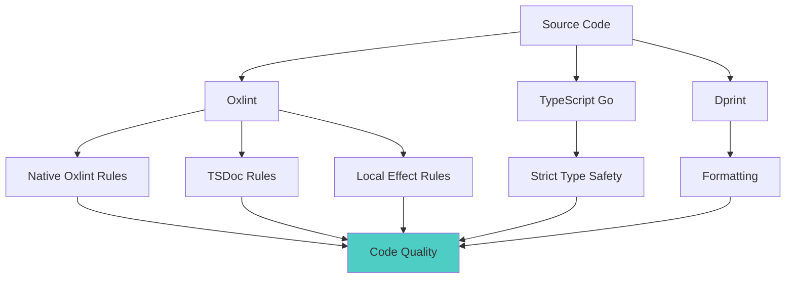

# Code Quality Guide

Code quality in this repository is enforced with **Oxlint**, **TypeScript Go**, **TypeScript**, and **Dprint**.

## Overview



## Toolchain

### 1. Oxlint

Oxlint is the repository linter.

It combines:

- native Oxlint rules configured directly in `oxlint.config.js`
- `eslint-plugin-jsdoc` through Oxlint JS plugin support for TSDoc enforcement
- local project rules for Effect-specific patterns
- `@effect/eslint-plugin` for barrel import protection

The repository intentionally keeps the lint configuration self-contained instead
of depending on a shared third-party preset.

The repository also keeps a small set of explicit exceptions for established
project patterns, especially:

- namespace imports used by Effect modules
- `no-console`
- a few Unicorn defaults that conflict with current project practices

### 2. TypeScript Go

Type checking runs through TypeScript Go via `tsgo`.

Important compiler checks still come from `tsconfig.json`, including:

- `strict`
- `noUnusedLocals`
- `noUnusedParameters`
- `noImplicitOverride`
- `exactOptionalPropertyTypes`

A `typecheck:legacy` script remains available as a fallback path through the
JavaScript TypeScript compiler while validating parity.

### 3. Dprint

Dprint handles formatting.

Use Dprint for formatting and Oxlint for linting. They serve different roles.

## Commands

```bash
# Lint
bun run lint
bun run lint:fix
bun run lint:type-aware

# Type safety
bun run typecheck
bun run typecheck:legacy

# Formatting
bun run format
bun run format:check

# Full verification
bun run validate
```

## Configuration Files

### Oxlint

- `oxlint.config.js`
- `oxlint-local-plugin.cjs`
- `oxlint-local-advanced-plugin.cjs`
- `eslint-local-rules.cjs`
- `eslint-local-rules-advanced.cjs`

`oxlint.config.js` is the source of truth for lint behavior in this repository.
It inlines the native Oxlint baseline and adds repository-specific JS plugins,
rules, and ignores.

The lint scripts intentionally run Oxlint through Node:

```bash
node ./node_modules/oxlint/bin/oxlint --config oxlint.config.js .
```

This remains necessary because Oxlint's JavaScript configuration support
currently expects a Node runtime.

Type-aware linting is enforced with warnings denied:

```bash
node ./node_modules/oxlint/bin/oxlint --config oxlint.config.js --type-aware --deny-warnings .
```

### TypeScript

- `tsconfig.json`
- `.vscode/settings.json`

Type checking uses:

```bash
tsgo --noEmit -p tsconfig.json
```

VS Code is configured to opt into tsgo with:

```json
{
  "typescript.experimental.useTsgo": true
}
```

### Formatting

- `dprint.json`

## Repository-Specific Rules

### TSDoc enforcement

TSDoc is enforced through the `eslint-plugin-jsdoc` rules loaded by Oxlint.

Important enforced checks include:

- descriptions are required
- parameter names must match
- parameter descriptions are required
- return descriptions are required
- function and method docs are required where configured

### Effect rules

The repository keeps the custom Effect-focused rules that existed before the
migration:

- `local/no-opaque-instance-fields`
- `local-advanced/no-try-catch-in-effect-gen`
- `local-advanced/no-type-assertions`
- `local-advanced/require-return-yield-for-errors`
- `local-advanced/no-effect-runsync-in-gen`
- `local-advanced/prefer-effect-constructors`
- `@effect/no-import-from-barrel-package`

These rules protect project invariants that are not covered well by generic
lint presets.

### Simplicity rules

The repository also enforces the focused "simple made easy" rules through the
same Oxlint JS plugin path:

- `local-advanced/no-ambient-time` for shared library modules in `src/lib/**`
- `local-advanced/no-ambient-randomness` for persistence modules in `src/db/**`
- `local-advanced/no-exported-mutable-bindings` for module stability
- `local-advanced/no-effect-gen-in-routes` for top-level route entry modules
- `local-advanced/no-feature-layer-imports` for feature `application` and `projections` boundaries
- `local-advanced/no-db-imports-in-ui` for UI modules under `src/routes/**` and `src/component/**`

These rules are intentionally narrow. They target the places where hidden time,
hidden randomness, mutable exports, route orchestration, or layer-crossing
imports create entanglement.

They are still only a subset of the broader architectural model. Use
`docs/architecture/template-simple-crud.md` and
`docs/architecture/effect-simple-made-easy-mapping.md` for the full template
boundary guidance.

## Ignore Policy

Oxlint ignores generated or non-source files such as:

- `dist`
- `build`
- `docs`
- `*.md`
- `*.js`
- `*.cjs`
- `.output`
- `.worktrees/`

This keeps linting focused on the TypeScript source of record.

## Development Workflow

Recommended loop:

```bash
bun run typecheck
bun run lint:fix
bun run format
```

Before publishing:

```bash
bun run validate
```

## Pre-commit Hooks

The repository pre-commit hook runs:

1. `bun run format`
2. `bun run lint:fix`
3. re-stages the updated files

## Troubleshooting

### Oxlint config does not load

Make sure the lint script runs Oxlint via Node, not by invoking the binary
without Node when using `oxlint.config.js`.

### TSDoc messages mention `jsdoc-js/...`

That is expected. The repository uses the JS plugin alias `jsdoc-js` because
Oxlint reserves the native `jsdoc` plugin name.

### Type-aware linting is slower

That is expected. Use plain `bun run lint` for the fast pass and
`bun run lint:type-aware` when validating semantic lint rules.

### Unused imports

Unused imports are enforced by Oxlint. Unused locals and parameters are also
caught by TypeScript Go through the repository's compiler settings.

## Best Practices

1. Prefer fixing the underlying type or control-flow problem over suppressing a rule.
2. Keep namespace imports only where they match established Effect module patterns.
3. Update docs when a lint rule changes expected contributor behavior.
4. Use `bun run validate` before considering the task complete.
5. Treat lint, typecheck, formatting, and tests as one quality system.
