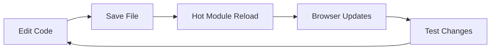

# Getting Started Guide

Welcome to the Effect TanStack Start project! This guide will help you get up and running quickly.

## Table of Contents

- [Prerequisites](#prerequisites)
- [Installation](#installation)
- [Project Structure](#project-structure)
- [Development Workflow](#development-workflow)
- [Common Tasks](#common-tasks)
- [Next Steps](#next-steps)

---

## Prerequisites

### Required

- **[Bun](https://bun.sh)** v1.0+ - JavaScript runtime and package manager
- **[Git](https://git-scm.com/)** - Version control

### Optional (for LAOS)

- **[Docker](https://docs.docker.com/get-docker/)** v20.10+
- **[Docker Compose](https://docs.docker.com/compose/install/)** v2.0+
- **[Nix](https://nixos.org/download/)** (optional for reproducible dev shell)

### Recommended Tools

- **[VS Code](https://code.visualstudio.com/)** with extensions:
  - Oxlint
  - Dprint
  - Tailwind CSS IntelliSense
  - Effect-TS Language Service

---

## Installation

### Quick Start (Local Development)

```bash
# Clone the repository
git clone <repository-url>
cd effect-tanstack-start

# Install dependencies
bun install

# Install Playwright browsers (for testing)
bunx playwright install --with-deps

# Copy environment template
cp .env.example .env

# Start the development server
bun run dev
```

The application will be available at http://localhost:3000

### Nix Dev Shell (Optional)

```bash
nix develop
```

### Quick Start (LAOS)

```bash
# Clone LAOS stack
git clone https://github.com/dtechvision/laos.git
cd laos

# Start observability stack
docker compose up -d
```

See [Observability Setup](./observability-setup.md) for full LAOS setup.

### Quick Start (App Docker)

```bash
docker build -t effect-tanstack-start .
docker run --rm -p 3000:3000 --env-file .env effect-tanstack-start
```

See [App Docker Guide](./app-docker.md) for details.

---

## Project Structure

```
effect-tanstack-start/
├── docs/                          # Documentation
│   ├── architecture/              # Architecture diagrams and docs
│   └── guides/                    # How-to guides
├── src/
│   ├── api/                       # API schemas and clients
│   │   ├── api-client.ts          # HTTP API client
│   │   ├── domain-api.ts          # REST API definitions
│   │   ├── domain-rpc.ts          # RPC definitions (effect/unstable/rpc)
│   │   └── todo-schema.ts         # Shared schemas
│   ├── lib/                       # Shared utilities
│   │   ├── atom-utils.ts          # Atom helpers
│   │   ├── logger-loki.ts         # Loki logger
│   │   ├── posthog-client.ts      # PostHog browser
│   │   ├── posthog-server.ts      # PostHog server
│   │   ├── telemetry-client.ts    # Sentry browser
│   │   └── telemetry-server.ts    # Sentry server
│   ├── routes/                    # File-based routing
│   │   ├── -index/                # Index route components
│   │   ├── api/                   # API routes
│   │   ├── __root.tsx             # Root layout
│   │   └── index.tsx              # Index page
│   ├── component/                 # Component tests
│   ├── visual/                    # Visual regression tests
│   ├── example.test.ts            # Effect-based unit tests
│   ├── telemetry-example.ts       # Telemetry demo
│   └── styles.css                 # Global styles
├── Dockerfile                     # Docker build configuration
├── package.json                   # Dependencies and scripts
├── vite.config.ts                 # Vite configuration
├── tsconfig.json                  # TypeScript configuration
└── CONTRIBUTING.md                # Contribution guidelines
```

### Key Directories Explained

**`src/api/`** - API layer

- Shared schemas between client and server
- Type-safe API clients
- RPC definitions using effect/unstable/rpc

**`src/lib/`** - Shared libraries

- Telemetry integrations (Sentry, PostHog, Loki)
- Utility functions
- Reusable Effect-based logic

**`src/routes/`** - Pages and API routes

- File-based routing powered by TanStack Router
- API routes use Nitro server framework
- Server functions with `createServerFn`

**`docker/`** - Service configurations

- Pre-configured monitoring stack
- Database settings
- Service-specific configs

---

## Development Workflow

### Development Server



```bash
# Start development server with hot reload
bun run dev

# Server runs on http://localhost:3000
# Changes auto-reload in browser
```

### Making Changes

1. **Edit Source Files**
   ```bash
   vim src/routes/-index/app.tsx
   ```

2. **Changes Auto-Reload**
   - Vite HMR updates browser instantly
   - No manual refresh needed

3. **View in Browser**
   - Open http://localhost:3000
   - See changes immediately

### Type Checking

```bash
# Check types (doesn't emit files)
bun run typecheck

# TypeScript will catch errors before runtime
```

### Building

```bash
# Build for production
bun run build

# Preview production build
bun run preview
```

---

## Common Tasks

### Adding a New Route

```bash
# Create a new route file
touch src/routes/about.tsx
```

```typescript
// src/routes/about.tsx
import { createFileRoute } from "@tanstack/react-router"

export const Route = createFileRoute("/about")({
  component: AboutPage,
})

function AboutPage() {
  return (
    <div>
      <h1>
        About
      </h1>
      <p>
        This is the about page
      </p>
    </div>
  )
}
```

Route automatically available at `/about`

### Adding an API Endpoint

```bash
# Create API route file
touch src/routes/api/hello.ts
```

```typescript
// src/routes/api/hello.ts
import { createServerFn } from "@tanstack/react-start"
import { Effect } from "effect"

export const GET = createServerFn("GET", () => {
  return Effect.succeed({
    message: "Hello, World!",
    timestamp: new Date().toISOString(),
  })
})
```

Available at `/api/hello`

### Adding State with Atoms

```typescript
import { useAtom } from "@effect/atom-react"
import * as Atom from "effect/unstable/reactivity/Atom"

// Define atom
const counterAtom = Atom.make(0)

// Use in component
function Counter() {
  const [count, setCount] = useAtom(counterAtom)

  return (
    <button onClick={() => setCount((value) => value + 1)}>
      Count: {count}
    </button>
  )
}
```

### Adding Tests

```bash
# Create test file
touch src/components/Button.test.tsx
```

```typescript
import { expect, test } from "vitest"
import { render } from "vitest-browser-react"
import { page } from "vitest/browser"
import { Button } from "./Button"

test("button renders and clicks", async () => {
  render(
    <Button>
      Click me
    </Button>,
  )

  const button = page.getByRole("button", { name: /click me/i })
  await expect.element(button).toBeVisible()

  await button.click()
  // Assert expected behavior
})
```

### Running Tests

```bash
# Run all tests
bun run test

# Run specific test suites
bun run test:unit        # Effect-based tests
bun run test:component   # Component tests
bun run test:visual      # Visual regression

# Watch mode
bun run test:watch
```

---

## Environment Variables

### Required for Full Features

```env
# .env file

# Sentry (optional in development)
SENTRY_DSN=

# PostHog (optional in development)
VITE_POSTHOG_KEY=
VITE_POSTHOG_HOST=http://localhost:8001

# Loki (auto-configured in Docker)
LOKI_ENDPOINT=http://localhost:3100/loki/api/v1/push

# Environment
NODE_ENV=development
```

### Optional Environment Variables

```env
# OTLP for traces (auto-configured in Docker)
OTLP_ENDPOINT=http://localhost:4318/v1/traces

# Server-side PostHog
POSTHOG_API_KEY=
POSTHOG_HOST=http://localhost:8000
```

---

## Troubleshooting

### Port Already in Use

```bash
# Find process using port 3000
lsof -i :3000

# Kill the process
kill -9 <PID>

# Or use a different port
PORT=3001 bun run dev
```

### Dependencies Not Installing

```bash
# Clear bun cache
rm -rf node_modules
rm bun.lockb

# Reinstall
bun install
```

### Types Not Working

```bash
# Restart TypeScript server in VS Code
# Cmd+Shift+P → "TypeScript: Restart TS Server"

# Check TypeScript configuration
bun run typecheck
```

### Hot Reload Not Working

```bash
# Restart dev server
# Ctrl+C to stop
bun run dev

# Check file watchers
# Some systems need increased limit
echo fs.inotify.max_user_watches=524288 | sudo tee -a /etc/sysctl.conf
sudo sysctl -p
```

---

## Next Steps

Now that you're set up, explore these guides:

1. **[Testing Guide](testing.md)** - Learn how to write and run tests
2. **[Telemetry Guide](telemetry.md)** - Set up monitoring and observability
3. **[PostHog Guide](posthog.md)** - Integrate analytics and feature flags
4. **[Observability Setup](./observability-setup.md)** - LAOS stack setup
5. **[App Docker Guide](./app-docker.md)** - Containerize the app
6. **[Architecture Overview](../architecture/overview.md)** - Understand the system design
7. **[Effect v4 Migration Guide](effect-v4-migration.md)** - Upgrade guidance and API mapping

---

## Additional Resources

- [Effect Documentation](https://effect.website)
- [TanStack Start Documentation](https://tanstack.com/router/latest/docs/framework/react/start/getting-started)
- [Bun Documentation](https://bun.sh/docs)
- [Vitest Documentation](https://vitest.dev)
