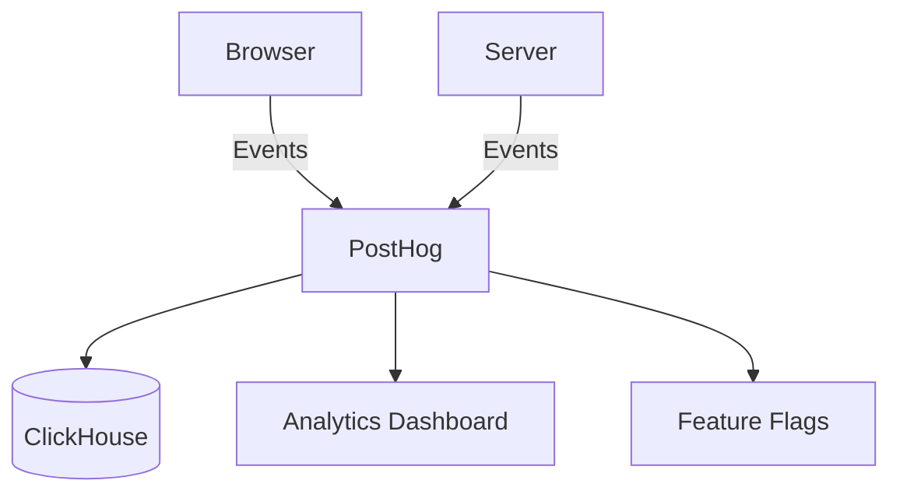

# PostHog Guide

Complete guide to analytics and feature flags with PostHog.

## Overview



## Quick Start

### Client-Side

```typescript
import { initPostHog, trackEvent } from "./lib/posthog-client"

// Initialize
initPostHog({
  apiKey: import.meta.env.VITE_POSTHOG_KEY,
  apiHost: import.meta.env.VITE_POSTHOG_HOST,
})

// Track events
trackEvent("button_clicked", {
  button_id: "signup",
  page: "/landing",
})

// Identify users
identifyUser({
  userId: "user-123",
  email: "user@example.com",
  plan: "pro",
})

// Feature flags
if (isFeatureFlagEnabled("new_dashboard")) {
  // Show new dashboard
}
```

### Server-Side

```typescript
import { Effect } from "effect"
import {
  createPostHogLayer,
  identifyServerUser,
  trackServerEvent,
} from "./lib/posthog-server"

const PostHogLive = createPostHogLayer({
  apiKey: process.env.POSTHOG_API_KEY,
  host: process.env.POSTHOG_HOST,
})

const program = Effect.gen(function*() {
  // Track events
  yield* trackServerEvent("user_signed_up", {
    distinctId: "user-123",
    plan: "premium",
  })

  // Identify users
  yield* identifyServerUser("user-123", {
    email: "user@example.com",
    name: "John Doe",
  })
})

Effect.runPromise(program.pipe(Effect.provide(PostHogLive)))
```

## Features

### Event Tracking

```typescript
// Page views
trackPageView("/dashboard")

// Custom events
trackEvent("purchase_completed", {
  amount: 99.99,
  product_id: "prod-123",
})
```

### Feature Flags

```typescript
// Client-side
const canAccessBeta = isFeatureFlagEnabled("beta_access")

// Server-side
const program = Effect.gen(function*() {
  const canAccessBeta = yield* isServerFeatureFlagEnabled(
    "beta_access",
    "user-123",
  )

  if (canAccessBeta) {
    // Show beta features
  }
})
```

### Session Recording

```typescript
// Start recording
startSessionRecording()

// Stop recording
stopSessionRecording()
```

## Dashboard

Access PostHog at http://localhost:8001 to view:

- Analytics dashboards
- User funnels
- Session recordings
- Feature flag management
- A/B test results

## Best Practices

1. **Track User Actions** - Not just page views
2. **Use Descriptive Event Names** - `purchase_completed` not `click`
3. **Add Context** - Include relevant properties
4. **Respect Privacy** - Mask sensitive data
5. **Test Flags** - Verify feature flags work correctly
