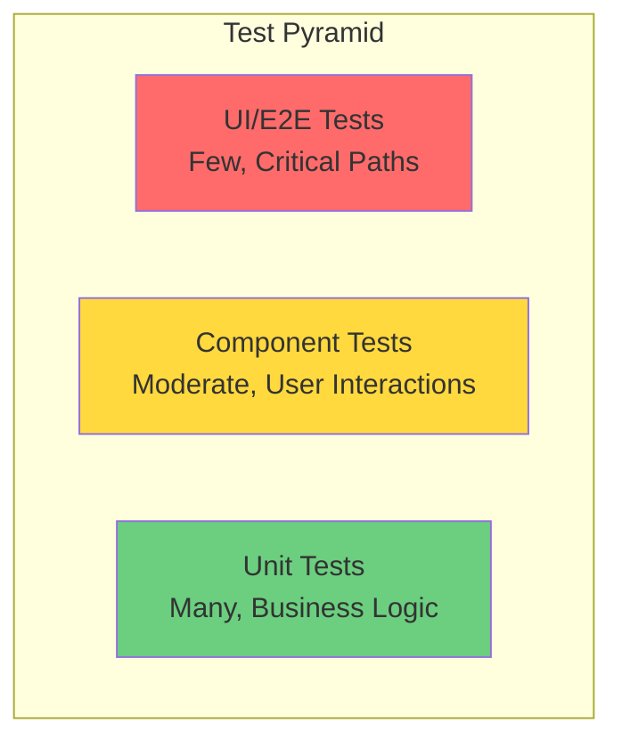
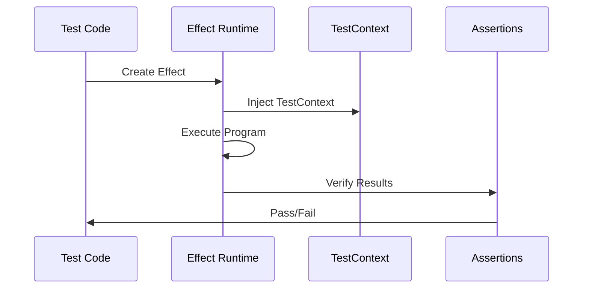
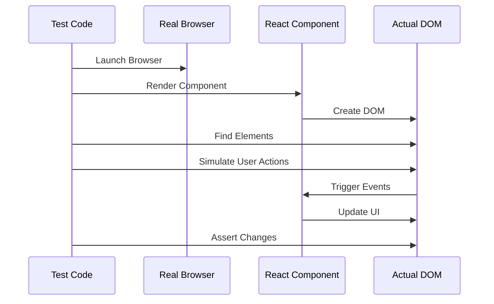
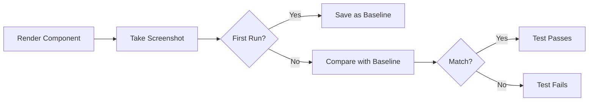

# Testing Guide

Comprehensive guide to testing in the Effect TanStack Start project using Vitest 4+, @effect/vitest, and browser-based testing.

## Table of Contents

- [Testing Philosophy](#testing-philosophy)
- [Test Types](#test-types)
- [Writing Tests](#writing-tests)
- [Running Tests](#running-tests)
- [Best Practices](#best-practices)
- [CI/CD Integration](#cicd-integration)

---

## Testing Philosophy

### Test Pyramid



**Our Approach:**

1. **Many Unit Tests** - Fast, Effect-based tests for business logic
2. **Moderate Component Tests** - User interaction testing in real browsers
3. **Few Visual Tests** - Critical UI components across browsers

### Lint Rules As Architectural Tests

Some simplicity guarantees are cheap enough to prove statically.
When a rule is mainly structural, encode it in lint and then verify it with
positive and negative examples.

This repository now uses lint-backed examples to protect a few design
boundaries directly:

- shared helpers receive time as data,
- repositories receive identity generation explicitly,
- route entry modules delegate instead of orchestrating,
- feature `application` and `projections` modules keep clean import boundaries,
- UI modules do not import database code directly,
- module exports remain immutable.

The verification examples live in `src/lint/simple-made-easy-rules.test.ts`.
Treat them as architectural tests: they prove not only that code passes lint,
but that the lint policy matches the design intent.

---

## Test Types

### 1. Effect-Based Unit Tests

Test business logic using Effect and @effect/vitest.

**Location:** `src/*.test.ts`

**Test Flow:**



**Example:**

```typescript
import { expect, it } from "@effect/vitest"
import { Clock, Effect, TestClock } from "effect"

it.effect("simulates time passage", () =>
  Effect.gen(function*() {
    // Start at time 0
    const start = yield* Clock.currentTimeMillis
    expect(start).toBe(0)

    // Advance time by 1 second
    yield* TestClock.adjust("1000 millis")

    // Verify time moved forward
    const end = yield* Clock.currentTimeMillis
    expect(end).toBe(1000)
  }))
```

#### Seeded PGlite Invariants

For server-side persistence tests, prefer node-mode `it.effect(...)` cases that
provide a seeded PGlite layer instead of mocking the repository or constructing
state indirectly through multiple setup calls.

This project exposes named seeds in `src/db/todos-test-support.ts`. Use them to
state the invariant under test directly:

```typescript
// @vitest-environment node

import { makeTodosApplicationTestLayer } from "@/db/todos-test-support"
import { listTodos } from "@/features/todos/application"
import { expect, it } from "@effect/vitest"
import * as Effect from "effect/Effect"

it.effect("seeded list order is stable", () =>
  Effect
    .gen(function*() {
      const todos = yield* listTodos

      expect(todos.map((todo) => todo.title)).toEqual([
        "Alpha todo",
        "Charlie todo",
        "Bravo done",
      ])
    })
    .pipe(Effect.provide(makeTodosApplicationTestLayer("mixedState"))))
```

Use this pattern when you need to prove repository and application invariants
against realistic persisted state. Keep these tests in node mode because the
browser runner is not the right environment for server-side PGlite modules.

### 2. Component Tests

Test React components in real browsers.

**Location:** `src/component/*.test.tsx`

**Test Flow:**



**Example:**

```typescript
import { expect, test } from "vitest"
import { render } from "vitest-browser-react"
import { page } from "vitest/browser"

test("form submission", async () => {
  render(<ContactForm />)

  // Interact like a real user
  const nameInput = page.getByLabelText(/name/i)
  await nameInput.fill("John Doe")

  const submitButton = page.getByRole("button", { name: /submit/i })
  await submitButton.click()

  // Verify the result
  await expect.element(page.getByText("Form submitted")).toBeVisible()
})
```

### 3. Visual Regression Tests

Capture and compare screenshots across browsers.

**Location:** `src/visual/*.test.tsx`

**Test Flow:**



**Example:**

```typescript
import { expect, test } from "vitest"
import { render } from "vitest-browser-react"

test("button visual regression", async () => {
  const screen = render(
    <Button variant="primary">
      Click me
    </Button>,
  )

  // Capture and compare screenshot
  await expect(screen.container).toMatchScreenshot("button-primary")
})
```

---

## Writing Tests

### Effect-Based Tests

#### Basic Test Structure

```typescript
import { expect, it } from "@effect/vitest"
import { Effect } from "effect"

it.effect("test name", () =>
  Effect.gen(function*() {
    // Arrange
    const input = 10

    // Act
    const result = yield* yourFunction(input)

    // Assert
    expect(result).toBe(20)
  }))
```

#### Testing Failures

```typescript
import { expect, it } from "@effect/vitest"
import { Effect, Exit } from "effect"

it.effect("handles errors correctly", () =>
  Effect.gen(function*() {
    const result = yield* Effect.exit(
      Effect.fail("Expected error"),
    )

    expect(result).toStrictEqual(Exit.fail("Expected error"))
  }))
```

#### Using TestClock

```typescript
it.effect("delayed operation", () =>
  Effect.gen(function*() {
    // Start a delayed operation
    const fiber = yield* Effect.fork(
      Effect.delay(Effect.succeed("result"), "5 seconds"),
    )

    // Advance time
    yield* TestClock.adjust("5 seconds")

    // Get result
    const result = yield* Fiber.join(fiber)
    expect(result).toBe("result")
  }))
```

#### Resource Management with Scopes

```typescript
it.scoped("manages resources", () =>
  Effect.gen(function*() {
    const resource = Effect.acquireRelease(
      Effect.succeed("resource"),
      () => Effect.log("cleanup"),
    )

    const value = yield* resource
    expect(value).toBe("resource")
    // Cleanup happens automatically
  }))
```

### Component Tests

#### Accessibility Testing

```typescript
test("accessible form", async () => {
  render(<LoginForm />)

  // Use semantic queries
  const emailInput = page.getByLabelText(/email/i)
  const passwordInput = page.getByLabelText(/password/i)
  const submitButton = page.getByRole("button", { name: /log in/i })

  // Verify ARIA attributes
  await expect.element(emailInput).toHaveAttribute("type", "email")
  await expect.element(passwordInput).toHaveAttribute("type", "password")
})
```

#### User Interaction Patterns

```typescript
test("multi-step form", async () => {
  render(<Wizard />)

  // Step 1
  await page.getByLabelText(/name/i).fill("John")
  await page.getByRole("button", { name: /next/i }).click()

  // Step 2
  await page.getByLabelText(/email/i).fill("john@example.com")
  await page.getByRole("button", { name: /next/i }).click()

  // Step 3 - Review
  await expect.element(page.getByText("John")).toBeVisible()
  await expect.element(page.getByText("john@example.com")).toBeVisible()

  // Submit
  await page.getByRole("button", { name: /submit/i }).click()
  await expect.element(page.getByText("Success")).toBeVisible()
})
```

### Visual Regression Tests

#### Component States

```typescript
test("button states", async () => {
  const { rerender } = render(
    <Button>
      Default
    </Button>,
  )
  await expect(screen.container).toMatchScreenshot("button-default")

  rerender(
    <Button disabled>
      Disabled
    </Button>,
  )
  await expect(screen.container).toMatchScreenshot("button-disabled")

  rerender(
    <Button loading>
      Loading
    </Button>,
  )
  await expect(screen.container).toMatchScreenshot("button-loading")
})
```

#### Responsive Layouts

```typescript
test("responsive navigation", async () => {
  render(<Navigation />)

  // Desktop view
  await page.viewport(1920, 1080)
  await expect(screen.container).toMatchScreenshot("nav-desktop")

  // Tablet view
  await page.viewport(768, 1024)
  await expect(screen.container).toMatchScreenshot("nav-tablet")

  // Mobile view
  await page.viewport(375, 667)
  await expect(screen.container).toMatchScreenshot("nav-mobile")
})
```

---

## Running Tests

### Command Reference

```bash
# Run all tests
bun run test

# Run specific test types
bun run test:unit          # Effect-based unit tests only
bun run test:component     # Component tests only
bun run test:visual        # Visual regression tests only

# Watch mode for development
bun run test:watch

# Update visual regression baselines
bun run test:visual:update

# Baselines in this repo are tracked under src/visual/__screenshots__/.
# Numbered failure captures such as *-1.png are transient and should not be committed.
# Visual tests disable browser file parallelism to reduce local Playwright startup crashes.
# If browser launch failures only reproduce inside a sandboxed agent run, verify once outside the sandbox before treating them as repo regressions.

# Run tests for specific browser
bun run test -- --project=chromium
bun run test -- --project=firefox
bun run test -- --project=webkit

# Run specific test file
bun run test src/component/Button.test.tsx

# Run with coverage
bun run test --coverage
```

### Test Configuration

Configuration in `vite.config.ts`:

```typescript
export default defineConfig({
  test: {
    globals: true,
    browser: {
      enabled: true,
      provider: playwright(),
      headless: true,
      instances: [
        { browser: "chromium", viewport: { width: 1280, height: 720 } },
        { browser: "firefox", viewport: { width: 1280, height: 720 } },
        { browser: "webkit", viewport: { width: 1280, height: 720 } },
      ],
    },
  },
})
```

---

## Best Practices

### 1. Test Behavior, Not Implementation

```typescript
// ❌ Bad - Testing implementation
test("sets loading state", async () => {
  const { component } = render(<UserProfile />)
  expect(component.state.loading).toBe(true)
})

// ✅ Good - Testing behavior
test("shows loading indicator", async () => {
  render(<UserProfile />)
  await expect.element(page.getByText("Loading...")).toBeVisible()
})
```

### 2. Use Semantic Queries

```typescript
// ❌ Bad - Fragile selectors
const button = page.getByClass("btn-primary")

// ✅ Good - Semantic queries
const button = page.getByRole("button", { name: /submit/i })
```

### 3. Test User Workflows

```typescript
// ✅ Good - Complete user flow
test("user can create and edit todo", async () => {
  render(<TodoApp />)

  // Create
  await page.getByPlaceholder(/new todo/i).fill("Buy milk")
  await page.getByRole("button", { name: /add/i }).click()
  await expect.element(page.getByText("Buy milk")).toBeVisible()

  // Edit
  await page.getByRole("button", { name: /edit/i }).click()
  await page.getByPlaceholder(/edit todo/i).fill("Buy almond milk")
  await page.getByRole("button", { name: /save/i }).click()
  await expect.element(page.getByText("Buy almond milk")).toBeVisible()
})
```

### 4. Isolate Test Data

```typescript
// ✅ Good - Each test is independent
test("displays user profile", async () => {
  const testUser = {
    id: "123",
    name: "Test User",
    email: "test@example.com",
  }

  render(<UserProfile user={testUser} />)
  // Test assertions...
})
```

### 5. Handle Async Operations

```typescript
// ❌ Bad - No waiting
test("loads data", async () => {
  render(<DataTable />)
  expect(page.getByText("Data loaded")).toBeVisible()
})

// ✅ Good - Wait for async operations
test("loads data", async () => {
  render(<DataTable />)
  // expect.element auto-retries until element appears
  await expect.element(page.getByText("Data loaded")).toBeVisible()
})
```

---

## CI/CD Integration

### GitHub Actions Example

```yaml
name: Test

on: [push, pull_request]

jobs:
  test:
    runs-on: ubuntu-latest

    steps:
      - uses: actions/checkout@v4

      - uses: oven-sh/setup-bun@v2
        with:
          bun-version: latest

      - name: Install dependencies
        run: bun install

      - name: Install Playwright browsers
        run: bunx playwright install --with-deps

      - name: Run tests
        run: bun run test
        env:
          CI: true

      - name: Upload test results
        if: always()
        uses: actions/upload-artifact@v4
        with:
          name: test-results
          path: |
            .vitest-attachments/
            __screenshots__/
```

### Test Reports

```yaml
      - name: Generate coverage report
        run: bun run test --coverage

      - name: Upload coverage to Codecov
        uses: codecov/codecov-action@v4
        with:
          file: ./coverage/coverage-final.json
```

---

## Debugging Tests

### Using Browser DevTools

```typescript
test("debug with devtools", async () => {
  render(<ComplexComponent />)

  // Tests pause here, browser stays open
  await page.pause()

  // Continue testing...
})
```

### Logging During Tests

```typescript
test("debug with logs", async () => {
  render(<Component />)

  const element = page.getByRole("button")
  console.log("Element count:", element.length)
  console.log("Element text:", await element.textContent())
})
```

### Screenshot on Failure

```typescript
test("captures failure screenshot", async () => {
  render(<Component />)

  try {
    await expect.element(page.getByText("Missing")).toBeVisible()
  } catch (error) {
    await page.screenshot({ path: "failure.png" })
    throw error
  }
})
```

---

## Additional Resources

- [Vitest Documentation](https://vitest.dev)
- [@effect/vitest Documentation](https://effect.website/docs/guides/testing/vitest)
- [Vitest Browser Mode](https://vitest.dev/guide/browser/)
- [Testing Library Best Practices](https://testing-library.com/docs/guiding-principles/)
